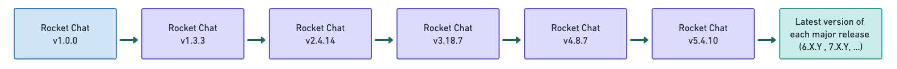

# Updating Rocket.Chat


As of December 15, 2023, Rocket.Chat has ceased support for connections from cloud services and official mobile/desktop apps to workspaces running legacy versions outside our support window. Users on unsupported legacy servers are advised to upgrade to the latest Rocket.Chat version to ensure continued access to cloud, mobile, and desktop applications. **Each Rocket.Chat version is supported for six months post-release.**


Keeping your Rocket.Chat installation up-to-date is essential to ensure that you have access to the latest features, bug fixes, and security enhancements. This guide will walk you through the process of updating Rocket.Chat across various deployment methods.

## Before you Update

To prepare for a successful Rocket.Chat update, it's vital to adhere to specific guidelines. Start by thoroughly understanding the [system-requirements.md](system-requirements.md "mention") and carefully reading the [release notes ](https://github.com/RocketChat/Rocket.Chat/releases)specific to your target version.&#x20;

**Backup your data**

Always perform a full backup of your Rocket.Chat instance, including the database and any custom configurations. This ensures that you can revert to a working state in case of any issues during the update.

**Avoid skipping major versions**

When you update from one major version to another, it is important to follow a sequential path and not skip any intermediate major versions. This is because each major version is a significant change, and skipping intermediate versions can lead to compatibility problems or unexpected behavior.

For example, if you are update your workspace from version 1.x.x to version 4.x.x, you should follow this path: **1.x.x -> 2.x.x -> 3.x.x -> 4.x.x.**

We recommend that you update to the latest version of the next release from your current version. Here is the recommended path:&#x20;

<figure><figcaption></figcaption></figure>


Skipping intermediate major versions, such as updating directly from 1.x.x to 4.x.x, can lead to problems because the software in 4.x.x may not be compatible with the data or settings that you have in 1.x.x.



See our [update version path flowchart](https://whimsical.com/upgrade-version-path-rocket-chat-51eoS7aUunTan5wLt2CBHU) and [demo](https://www.youtube.com/watch?v=y9cLve2G8H0) for a more detailed workflow on updating your workspace from the oldest version (1.x.x) with MMAP to the latest version with the supported MongoDB release.



Update Version Path


### Updating Rocket.Chat

Updating your Rocket.Chat workspace to a new version involves several steps, which can vary depending on the [deployment method ](./)you're using.

1. If you [deployed your workspace with Docker](deploy-with-docker-and-docker-compose.md), follow the [**update Rocket.Chat on docker guide**](deploy-with-docker-and-docker-compose.md#updating-rocket.chat-on-docker)**.**&#x20;
2. If you [deployed your workspace with Snaps](deploy-with-snaps.md), see the [**update Rocket.Chat on snaps guide**](deploy-with-snaps.md#updating-rocket.chat-snap)**.**
3. If you deployed your workspace following the manual installations, continue with the following steps:

Manual installation includes Rocket.Chat deployment on [CentOS](additional-deployment-methods/deploy-with-centos.md) and Debian distributions.

To update the Rocket.Chat server deployed via manual installation,&#x20;

* Stop Rocket.Chat service:

```
sudo systemctl stop rocketchat
```

* Remove the installation folder, usually in _/opt_

```
sudo rm -rf /opt/Rocket.Chat
```

* Ensure you have the needed build packages for Debian.

```
sudo apt-get install -y build-essential graphicsmagick
```

* Update the node version required by Rocket.Chat. Check the [release notes](https://github.com/RocketChat/Rocket.Chat/releases) for the supported engine versions for MongoDB and NodeJs, and install as recommended.&#x20;

```
sudo n install <x.x.x>
```

* Download the latest version of Rocket.Chat:

```
curl -L https://releases.rocket.chat/latest/download -o /tmp/rocket.chat.tgz
```

```
tar -xzf /tmp/rocket.chat.tgz -C /tmp
```

* Install it and set the proper permissions to Rocket.Chat folder with these commands:

```
cd /tmp/bundle/programs/server && npm install
```

```
sudo mv /tmp/bundle /opt/Rocket.Chat
```

```
sudo chown -R rocketchat:rocketchat /opt/Rocket.Chat
```

* Start the Rocket.Chat service:

```
sudo systemctl start rocketchat
```


If you have any concerns or issues with updating Rocket.Chat, see [updating-rocket.chat-faq.md](../../resources/frequently-asked-questions/deployment-faq/updating-rocket.chat-faq.md "mention")


### Updating MongoDB

Refer to [#mongodb-versions](../../customer-center/support-center/premium-support-plans/support-prerequisites-and-version-durability.md#mongodb-versions "mention") and learn more about the supported MongoDB versions for your Rocket.Chat workspace and how to update.
