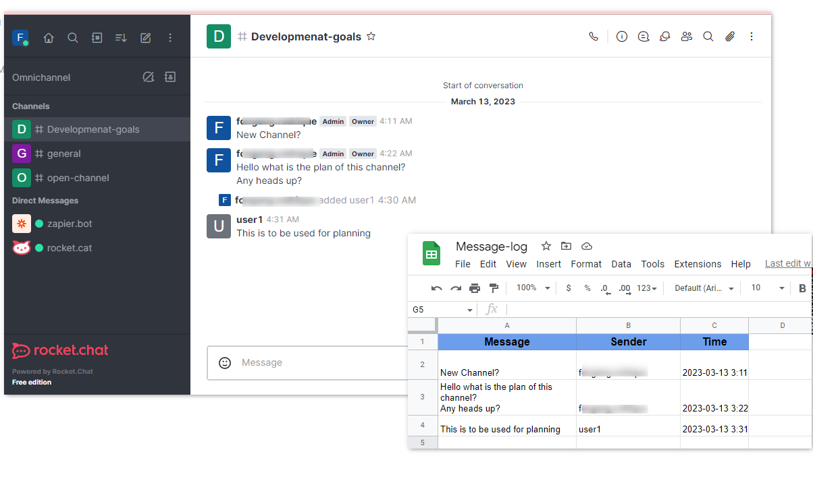

# Using Zapier App

With the Zapier app installed on your workspace by the workspace administrator, you can start using the integration by simply going to the [Zapier platform ](https://zapier.com/)and creating Zaps with the `Rocket.Chat` app.

To verify the installation of the app, navigate to **Administrator** > **Apps** > **Installed**


The Rocket.Chat app on the Zapier platform can function both as a trigger and an action in creating your Zap. For a comprehensive list of available actions and triggers, refer to this list [#rocket.chat-zapier-actions-and-triggers](./#rocket.chat-zapier-actions-and-triggers "mention")


To illustrate the integration's functionality, we have provided some example Zaps:

* Using Rocket.Chat Trigger to Rocket.Chat Action
* Rocket.Chat Trigger to External Action
* External Trigger to Rocket.Chat Action

## Zapier Rocket.Chat Trigger to Rocket.Chat Action

This example makes use of the Rocket.Chat `New channel` trigger and the `Send direct message` action.

This sends a [Direct Message](../../../../use-rocket.chat/user-guides/rooms/direct-messages/) to a user when a new Channel is created.

Zapier Send a Direct Message when a new Channel is created

Follow these steps to create the zap.

* Log in to your [Zapier dashboard](https://zapier.com/app/dashboard)
* Click on **+Create Zap** to begin creating a new Zap
* Search and select the `Rocket.Chat` app as Trigger
* In the event field, select the `New channel` event
*   In the Account settings, click **Sign in** to your Rocket.Chat workspace. A window pops up requesting your workspace URL

    * Fill in your workspace BaseURL then click **Yes, continue**&#x20;
    * **Authorize** with the Rocket.Chat OAuth to link the currently logged-in user

    

<!---->

* Click **Continue** after a successful connection then **Test Trigger**

After Configuring the Zapier Trigger, the next step is configuring the Action.

* Search and select the `Rocket.Chat` app as the Action app
* In the event field, select the `Send direct message` event and **Continue**
* Select the Rocket.Chat workspace linked above or connect another Rocket.Chat workspace to use
*   Configure the desired field in the action section to format the message structure using the example data available

    * **Message**: The message text to send.
    * **User**: Select the user to be DMed.
    * **Alias**: The user to send the message as.

    
* Click **Continue** then **Test action**. You receive a test message formatted as configured.
* **Publish** and **Turn On** the Zap

After creating the Zap, you can test its functionalities by [Creating a new Channel](../../../../use-rocket.chat/user-guides/rooms/channels/create-a-new-channel.md) and confirm you received a message from the `zapier.bot` with the Alias you configured with information about a newly created channel.

## Zapier Rocket.Chat Trigger to External Action

This example makes use of the Rocket.Chat `New message posted on public channel` trigger and the Google Sheets `Create Spreadsheet Row in Google Sheets` action.

This creates a Google Sheet row to an existing sheet when a message is posted in any public Rocket.Chat [Channel](../../../../use-rocket.chat/user-guides/rooms/channels/).

Zapier Create Google Sheet row when a message is posted in a public Channel

Follow these steps to create the zap.

* Log in to your [Zapier dashboard](https://zapier.com/app/dashboard)
* Click on **+Create Zap** to begin creating a new Zap
* Search and select the `Rocket.Chat` app as Trigger
* In the event field, select the `New message posted on public channel` event
*   In the Account settings, click **Sign in** to your Rocket.Chat workspace. A window pops up requesting your workspace URL

    * Fill in your workspace BaseURL then click **Yes, continue**&#x20;
    * **Authorize** with the Rocket.Chat OAuth to link the currently logged-in user

    

<!---->

* Click **Continue** and choose the public Channel to listen in on your workspace then **Test Trigger**

After Configuring the Zapier Trigger, the next step is configuring the Action.

* Search and select the `Google Sheets` app as the Action app
* In the event field, select the `Create Spreadsheet Row` event and **Continue**
* In the Account settings, click **Sign in** to authenticate and connect your Google account
* Select the desired **Drive**, **Spreadsheet**, and **Worksheet** to write to
*   Set the data to be inputted under the respective Sheet column

    
* Click **Continue** then **Test action**. You see the sheet filled with some example data
* **Publish** and **Turn On** the Zap

After creating the Zap, whenever a message is posted in the specified channel, a Google Sheet row gets created

## Zapier External Trigger to Rocket.Chat Action

This example makes use of the `New Message Posted to Channel` in Slack trigger and the `Send private group message` Rocket.Chat action.

This forwards any message sent in a Slack channel to a private channel in Rocket.Chat.

Zapier forward Slack Messages to Rocket.Chat Channel

Follow these steps to create the zap.

* Log in to your [Zapier dashboard](https://zapier.com/app/dashboard)
* Click on **+Create Zap** to begin creating a new Zap
* Search and select the `Slack` app as Trigger
* In the event field, select the `New Message Posted to Channel` event and **Continue**
* In the Account settings, click **Sign in** to authenticate and connect your Slack account
* Select the Slack Channel to listen to and **Continue**

After Configuring the Zapier Trigger, the next step is configuring the Action.

* Search and select the `Rocket.Chat` app as the Action app
* In the event field, select the `Send private group message` event and **Continue**
* Select a linked Rocket.Chat workspace **Sign in** to a Rocket.Chat workspace to use
*   Configure the desired field in the action section to format the message structure using the example data available

    * **Message**: The message text to send.
    * **Group**: The private Rocket.Chat group to post the message in.
    * **Alias**: The user to send the message as.

    

<!---->

* Click **Continue** then **Test action**. You receive a test message in then private group formatted as configured
* **Publish** and **Turn On** the Zap

After creating the Zap, whenever a message is posted in the specified Slack Channel, it gets forwarded to a Rocket.Chat private Group.

