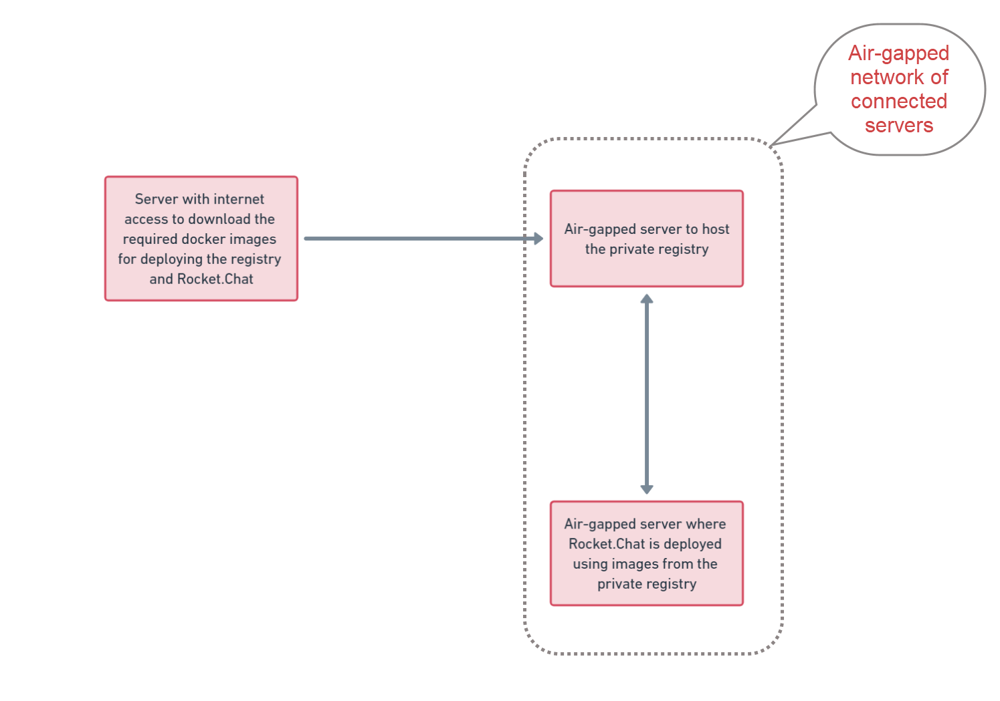

# Rocket.Chat Air-gapped Deployment

An air-gapped computer system is one that is not able to connect to any external network or the internet. It ensures that a secure computer network is physically isolated from unsecured networks, such as the public internet or an unsecured local area network. This isolation makes it challenging for malware or hackers to infiltrate sensitive systems, providing a strong defense against cyber threats.&#x20;

There are two options for deploying Rocket.Chat in an air-gapped environment:

1. [Copy Rocket.Chat Docker images from a server with internet access](./#copy-rocket.chat-docker-images-from-a-server-with-internet-access)
2. [Deploying Rocket.Chat with a Private Docker Registry](./#deploying-rocket.chat-with-a-private-docker-registry)

In this guide, we'll discuss the two options above to deploy your Rocket.Chat workspace.

## Copy Rocket.Chat Docker images from a server with internet access

Given that an air-gapped environment has no internet access, simply download the required docker images on a server with internet access and transfer them to the air-gapped server.&#x20;

### **Prerequisites**

* One server that has internet access to download the docker images.
* One air-gapped server to deploy Rocket.Chat.
* Ensure that Docker is installed and operational on the two servers.&#x20;
* The two servers must be able to communicate with each other.&#x20;


This example guide assumes that all your servers belong to the same network. Transfer methods may vary depending on your company's policies and network configurations.


### **Download the Rocket.Chat images**

1. Go to the server with internet access and download the Rocket.Chat and MongoDB images with this command:

```bash
docker pull registry.rocket.chat/rocketchat/rocket.chat:latest

docker pull docker.io/bitnami/mongodb:${MONGODB_VERSION:-5.0}
```


Confirm that you are downloading the appropriate MongoDB version for your Rocket.Chat version by checking our [release notes](https://github.com/RocketChat/Rocket.Chat/releases).


2. Run `docker images` to see the images you just downloaded.
3. Save the images as `.tar` files with these commands:

```bash
docker save -o rocketchat.tar registry.rocket.chat/rocketchat/rocket.chat:latest

docker save -o mongodb.tar bitnami/mongodb:5.0
```

4. Run `ls` to see the rocketchat.tar and mongodb.tar files.
5. Transfer the tar files to your air-gapped server with the following commands:


```bash
scp -i [key] <rocketchat_tar_file_path> <user_name@target_ip_address:/destination_path>

scp -i [key] <mongodb_tar_file_path> <user_name@target_ip_address:/destination_path>
```


Update the following with the appropriate values:

* `key` : The key to access the air-gapped server where the file should be sent.
* `rocketchat_tar_file_path` : The `rocketchat.tar` file path.
* `mongodb_tar_file_path` : The `mongodb.tar` file path.
* `user_name@target_ip_address`: The username and IP address of the air-gapped server where the file should be sent.
* `destination_path`: The directory path on the air-gapped server where the file should be located.

For example,

```bash
 scp -i firstServer.pem rocketchat.tar ubuntu@176.37.27.133:/home/ubuntu
```


This example guide assumes that all your servers belong to the same network. Transfer methods may vary depending on your company's policies and network configurations.


### **Deploy Rocket.Chat on the air-gapped server**

1. Go to the destination directory in the air-gapped server where you transferred the tar files.&#x20;
2. Run  `ls` to confirm that the `rocketchat.tar` and `mongodb.tar` files were transferred successfully.
3. Load the images to Docker with the following commands:

```bash
docker load -i rocketchat.tar

docker load -i mongodb.tar
```

You've successfully transferred the Rocket.Chat and MongoDB images to the air-gapped server. Run `docker images` to view them.

4. Create a `docker-compose.yaml`  based on our [official compose](https://github.com/RocketChat/Docker.Official.Image/blob/master/compose.yml) file and update it according to your needs.
5. Edit the `ROOT_URL`  in the _docker-compose.yaml_ file from the default `http://localhost:3000` to match your server URL or domain name. For example,

```
ROOT_URL:  http://172.55.18.208
```

6. To install Rocket.Chat, execute this command:

```shell
docker compose up -d
```

7. Confirm that the RocketChat and Mongo DB containers are actively running by executing the command `docker ps`.
8. To see the log/status of your Rocket.Chat container, execute this command:

```bash
docker compose logs -f rocketchat
```

It also displays your site URL, which you can use to access your workspace.

Now, you have successfully deployed Rocket.Chat in your air-gapped environment. Log into your workspace using your site URL and the first user to log in becomes the workspace administrator.

The following section walks you through the second deployment method.

## Deploying Rocket.Chat with a Private Docker Registry

A [docker registry](https://docs.docker.com/registry/) is a system for storing and distributing Docker images with specific names. Considering that an air-gapped computer can't access the internet to download the required docker images for deploying Rocket.Chat, this method will demonstrate how to use a private registry to store the necessary images and deploy Rocket.Chat.

Deploying Rocket.Chat with a private registry can be summarized into three phases:

1. [Create a private remote registry](./#create-a-private-registry)
2. [Pull and push the Rocket.Chat and MongoDB images to the registry](./#pull-and-push-the-rocket.chat-mongodb-images-to-the-registry)
3. [Install Rocket.Chat with the images from the remote registry](./#install-rocket.chat)

### **Prerequisites**

* One server that has internet access to download the docker images.
* Two air-gapped servers ( one for hosting the private registry, one for installing Rocket.Chat).
* Ensure that docker is installed and operational on the three servers.
* The three servers must be able to communicate with each other.

The diagram below highlights an overview of the servers:

<figure><figcaption><p>Air-gapped deployment with private registry servers</p></figcaption></figure>


This example guide assumes that all your servers belong to the same network. Transfer methods may vary depending on your company's policies and network configurations.


### **Create a private registry**

Given that the server to host the registry doesn't have internet access, it is impossible to download images from DockerHub or any public registry.  As a result, you need to download the registry image on a server with internet access and transfer it to the air-gapped registry host server before proceeding with the installation.&#x20;

Follow these steps to complete the process:

1. On the first server which has internet access, pull the image that'll be used to create the registry with this command:

```bash
docker pull registry:2
```

2. Run `docker images` to see that the image has been downloaded.
3. Create a tar file with the registry image and transfer it to the registry host server with these commands:

```bash
docker save -o registry_image.tar registry:2
```

```
scp -i [key] <registry_tar_file_path> <user_name@target_ip_address:/destination_path>
```

Update the following with the appropriate values:

* `key` : The key to access the registry host server where the file should be sent.
* `registry_tar_file_path` : The `registry_image.tar` file path.
* `user_name@target_ip_address`: The username and IP address of the registry host server where the file should be sent.
* `destination_path`: The directory path on the registry host server where the file should be located.

For example,&#x20;

```bash
scp -i firstServer.pem registry_image.tar ubuntu@172.31.81.10:/home/ubuntu
```


This example guide assumes that all your servers belong to the same network. Transfer methods may vary depending on your company's policies and network configurations.


4. Now, go to the air-gapped registry host server.  Run the following commands to confirm that you don't have the registry image or container yet:

```bash
docker images 

docker ps
```

5. Navigate to the destination path where you sent the tar file and run the `ls` command and verify that the transfer was successful.
6. To load the tar file on the air-gapped registry host server, execute this command in your preferred directory:

```bash
docker load -i registry_image.tar
```

7. Now run `docker images`  to see the registry image that you downloaded and transferred from the first server.
8. To start the registry container for this image, execute this command:

```bash
docker run -d -p 5000:5000 --restart=always --name private-registry registry:2
```


* It's not mandatory to run the container on port 5000. The suggested port is an example and can be updated according to your specific requirements.
* Update `private-registry` with your preferred name for the registry container.
* For production environments, ensure the persistence of images by either specifying a local folder on the host for storage or by implementing other suitable persistence mechanisms.


9. Run `docker ps` to see the new registry container running.

Now, you have a functioning remote registry on an air-gapped server ready to store the Rocket.Chat and Mongo DB images.

### **Pull and push the Rocket.Chat MongoDB images to the registry**

Recall that the registry server has no internet access, so it's impossible to download the Rocket.Chat and MongoDB images from external registries. Alternatively, download the images on the first server with internet access and push the images to the remote registry.&#x20;

Follow these steps to continue the process:

1. Return to the first server with internet access and execute these docker-pull commands to download the Rocket.Chat  and MongoDB images:

```bash
docker pull registry.rocket.chat/rocketchat/rocket.chat:latest

docker pull docker.io/bitnami/mongodb:${MONGODB_VERSION:-5.0}
```


Confirm that you are downloading the appropriate MongoDB version for your Rocket.Chat version by checking our [release notes](https://github.com/RocketChat/Rocket.Chat/releases).


2. Run `docker images`  to confirm that the images have been successfully downloaded.
3. Tag the Rocket.Chat and MongoDB images with these commands:


```bash
docker tag registry.rocket.chat/rocketchat/rocket.chat:latest <registry_ip_address>:5000/registry.rocket.chat/rocketchat/rocket.chat:latest

docker tag bitnami/mongodb:5.0 <registry_ip_address>:5000/docker.io/bitnami/mongodb:${MONGODB_VERSION:-5.0} 
```


Update `<registry_ip_address:5000>` with the IP address of your registry host server and the appropriate port number, if your registry container is not running on port 5000.

4. Execute the `docker images` command to see the newly tagged images in the list of images.
5. If the air-gapped registry host server is HTTP, modify the docker daemon file to allow communication with insecure registries:

```bash
sudo nano /etc/docker/daemon.json
```

6. Update the file with the following content and save it:

```json
{
    "insecure-registries": ["<registry_ip_address>:5000"]
}
```

Update `<registry_ip_address:5000>` with the IP address of your registry host server and the appropriate port number if your registry container is not running on port 5000.&#x20;

7. Restart docker with this command:

```bash
sudo systemctl restart docker
```

8. Push the tagged images to the remote registry on the air-gapped server with these commands:


```bash
docker push <registry_ip_address>:5000/registry.rocket.chat/rocketchat/rocket.chat:latest

docker push <registry_ip_address>:5000/docker.io/bitnami/mongodb:${MONGODB_VERSION:-5.0}
```


Update `<registry_ip_address:5000>` with the IP address of your registry host server and the appropriate port number if your registry container is not running on port 5000.&#x20;

9. Now, go to the air-gapped registry host server to confirm that the images were successfully pushed. To do this, run this command to open an interactive shell inside the registry container:

```bash
docker exec -it private-registry sh
```


Update `private-registry` with the name of your registry container if it's different.


10. Execute this command to see the docker images in the registry:

```
ls /var/lib/registry/docker/registry/v2/repositories
```

Confirm that the MongoDB and Rocket.Chat image exists in the registry, and you're ready to install Rocket.Chat from the remote registry.


You may only see the first name of the image path. For example , _docker.io_ instead of  _/docker.io/bitnami/mongodb_.


### **Install Rocket.Chat**

Now that the Rocket.Chat and MongoDB images have been pushed to the remote registry, the next step is to install Rocket.Chat on the third server. Note that the third server is also air-gapped and does not have internet access. Therefore, you have to deploy Rocket.Chat using the images from the remote registry.

1. Run these commands to confirm that no Rocket.Chat and MongoDB images are running on the server.

```bash
docker images 

docker ps
```

2. If you are using HTTP to communicate between your server and registry, modify the docker daemon file to allow communication with insecure registries:

```bash
sudo nano /etc/docker/daemon.json
```

3. Update the file with the following content and save it:

```json
{
    "insecure-registries": ["<registry_ip_address>:5000"]
}
```


Update `<registry_ip_address:5000>` with the IP address of your registry host server and the appropriate port number, if your registry container is not running on port 5000.&#x20;


4. Restart docker with this command:

```
sudo systemctl restart docker
```

5. Create a `docker-compose.yaml`  based on our [official compose](https://github.com/RocketChat/Docker.Official.Image/blob/master/compose.yml) file and update it according to your needs.
6. Edit the `ROOT_URL`  in the _docker-compose.yaml_ file from the default `http://localhost:3000` to match your server URL or domain name. For example,

```
ROOT_URL:  http://172.55.18.208
```

7. Update the image paths for Rocket.Chat and MongoDB to reference the images on the remote registry. For example,


```yaml
rocketchat:
    image: <registry_ip_address>:5000/registry.rocket.chat/rocketchat/rocket.chat:${RELEASE:-latest}
    
mongodb:
    image:<registry_ip_address>:5000/docker.io/bitnami/mongodb:${MONGODB_VERSION:-5.0}
```



Update `<registry_ip_address:5000>` with the IP address of your registry host server and the appropriate port number, if your registry container is not running on port 5000.&#x20;


8. Install Rocket.Chat by executing this command:

```shell
docker compose up -d
```

9. Run these commands to confirm that the RocketChat and Mongo DB  images are present with their containers actively  running:

```bash
docker images 

docker ps
```

10. To see the log/status of your Rocket.Chat container, execute this command:

```
docker compose logs -f rocketchat
```

It also displays your site URL, which you can use to access your workspace.

Now, you have successfully deployed Rocket.Chat in your air-gapped environment. Log into your workspace using your site URL, and the first user to log in becomes the workspace administrator.

In the next topics, you can learn how to register and configure your air-gapped workspace.
