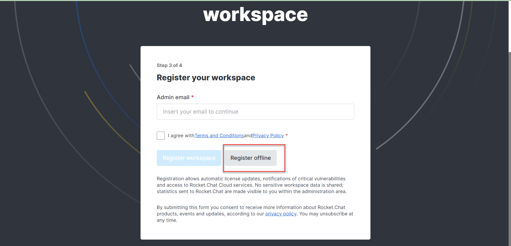

# Offline Workspace Registration

After deploying your air-gapped workspace successfully, navigate to your workspace URL and continue with the following steps to register your workspace on [Rocket.Chat Cloud](https://cloud.rocket.chat/):

* Complete the **Admin and Organization Information** steps in the [rocket.chat-setup-wizard.md](../accessing-your-workspace/rocket.chat-setup-wizard.md "mention").
* Click the **Register Offline** button. It displays a **token** with some instructions to paste it in [Rocket.Chat Cloud](https://cloud.rocket.chat/).

<figure><figcaption>
Register Offline
</figcaption></figure>

* Go to your [Rocket.Chat Cloud](https://cloud.rocket.chat/) account. Navigate to **Workspaces** and click **Register self-managed**. Click the **Continue Offline** button and paste the **token** displayed earlier from your workspace setup wizard.
* Click **Continue.** Another **code** is generated on Rocket.Chat Cloud to finalize your workspace registration. Copy that code and click **Continue.**
* Go back to the **Register Offline** screen on your workspace **Setup Wizard** where the initial token was generated, agree to the [**Terms**](broken-reference) and [**Privacy Policy**](broken-reference)**,** then click **Next.**
* Paste the code generated from [Rocket.Chat Cloud](https://cloud.rocket.chat/) and click **Complete Registration**.

Once you've completed these steps, your workspace will be set up and ready to use. You can access it by logging in with your admin credentials. You can always update  your setup information in **Workspace Administration** [setup-wizard.md](../../use-rocket.chat/workspace-administration/settings/setup-wizard.md "mention").


For  workspaces that accessible through the internet, kindly visit [setup-wizard.md](../../use-rocket.chat/workspace-administration/settings/setup-wizard.md "mention") to set up your workspace.


### &#x20;.png>) Register Air-gapped workspaces on versions below 6.5

To register a workspace on a version below 6.5 without internet access,

* Navigate to **Administration** > **Workspace** > **Settings** > **Setup Wizard** > **Cloud Info** and enable **Cloud Service Privacy Terms Agreement.**  Enabling it means you agree with the [Terms](https://rocket.chat/terms) & [Privacy Policy](https://rocket.chat/privacy).
* Navigate to **Administration** > **Workspace** > **Registration** and click **Register Offline**.
* Copy the code snippet that is displayed on the pop-up box.
* Create an account or login into your [Rocket.Chat cloud portal](https://cloud.rocket.chat).
* Then, click on **Register self-managed** to register a new workspace.
* Click **Continue Offline** if you are running an air-gapped workspace or your server has no internet connection.
* Paste the code you copied earlier from **Connectivity Services** and click **Continue.**
* You are provided with another code from the cloud portal. Copy the code and go back to your local workspace.
* On your local workspace, paste the code you got from the cloud portal and click **Finish Registration.**


With that done, you have successfully registered your workspace.


Moving to the next section, we'll guide you on how to apply [offline-license.md](offline-license.md "mention") to your air-gapped workspace.
