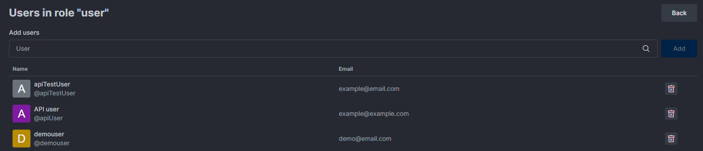

# Supported Mongo Versions

Required MongoDB versions can change across different major versions. It is very important that you choose the correct database version when deploying and also to make sure your existing installation is using a supported version.

### Using release notes

You can always check the supported version list on our GitHub releases page.

Use the following "template" link to inspect the release notes and supported MongoDB releases.


https://github.com/RocketChat/Rocket.Chat/releases/\<VERSION>


For example, if you want to check what are the supported MongoDB versions for release `6.0.0`, you can go to [https://github.com/RocketChat/Rocket.Chat/releases/6.0.0](https://github.com/RocketChat/Rocket.Chat/releases/6.0.0) and look for "Engine versions".

<figure><figcaption><p>Required Mongo version</p></figcaption></figure>

### Using releases API

The other option is to use our releases API.


This is a relatively new addition, information on old versions can't be viewed by this API


This one is a very quick way of getting the list and is also ideal if you want to get this information dynamically for some kind of automation or script.

If you want to see the supported MongoDB versions for the latest release, you can perform a GET against the following endpoint

[https://releases.rocket.chat/latest/info](https://releases.rocket.chat/latest/info)

You can change `latest` with any version number and get more specific information. The key you're looking for is `compatibleMongoVersions`.

Using `curl` with `jq` would look something like:

```
{
    "tag": "6.0.0",
    "commit": "aa8f0ec70b2267af55d9ce9a3e3abfe7ff6c0a37",
    "key": "build/rocket.chat-6.0.0.tgz",
    "etag": "8cfdb5bc71da00605faa00c46ef7d929-32",
    "count": 2840,
    "nodeVersion": "14.21.2",
    "compatibleMongoVersions": [
        "4.4",
        "5.0",
        "6.0"
    ]
}
```

### Recommended MongoDB version

If it is an existing deployment, being fairly in the middle of the supported list is a good idea. We know how hard it is to update our databases, especially if it's a large deployment.

If you're going to deploy fresh, we recommend choosing the latest version that is supported.&#x20;


We don't remove MongoDB support overnight. A version marked to be removed from support is first deprecated and as a workspace admin, you see a deprecation warning in your Rocket.Chat logs and the notice banner on their instances.


## Deprecation archive



See a list of Releases, Mongo versions, and their deprecation notice here [#mongodb-versions](../../../resources/get-support/enterprise-support-and-version-durability/#mongodb-versions "mention")


**Note** Without the MongoDB version we can't ensure you are running a compatible version. If you are running your MongoDB with auth enabled and a **user different from admin** you may need to grant permissions for this user to check cluster data. You can do it via Mongo shell running the following command replacing the string _YOUR\_USER_ by the correct user\\'s name:

```
db.runCommand({ grantRolesToUser: "YOUR_USER" , roles: [{role: "clusterMonitor", db: "admin"}]})
```

## Supported Storage Engines

Mmapv1 is no longer supported in MongoDB since version 4.2. So to make sure you update your Rocket.Chat installations easily in the future, use the [WiredTiger](https://docs.mongodb.com/manual/core/wiredtiger/) storage engine. If you're already running mmapv1, please [migrate to wiredTiger](mongodb-mmap-to-wiredtiger-migration.md) immediately.
