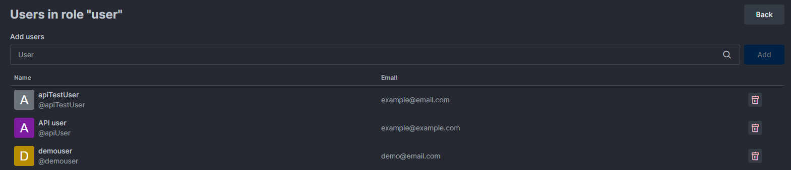

# Roles in Rocket.Chat

Roles and permissions are integral to managing access in any digital workspace. Rocket.Chat's comprehensive role-based system allows administrators to assign roles, each with a specific set of [permissions](../use-rocket.chat/workspace-administration/permissions/), to control user actions and access levels within the workspace.

A role refers to a set of permissions and privileges assigned to a user or a group of users within the workspace. The roles determine the controls and features a user can access or handle in a workspace. They are displayed as mini tags beside the username on messages.

You can view the roles from **Administration** > **Permissions**. The **Name** row displays the roles. The permissions that each role has are displayed in the table. You can edit the permissions and roles as per your needs.

This topic guides you through the categories of roles available in Rocket.Chat and the scope within which the roles can be applied to users.

## Categories of Rocket.Chat Roles

The following categories of roles are available in Rocket.Chat:

### **Rocket.Chat Administrator Role**

A Rocket.Chat administrator has the `admin` role, which gives full access to the entire Rocket.Chat workspace. They can manage both [workspace-administration](../use-rocket.chat/workspace-administration/ "mention") and [omnichannel](../use-rocket.chat/omnichannel/ "mention") settings.

### **Rocket.Chat User Roles**

Rocket.Chat users can have one or more roles, allowing them to perform the various actions granted by the role's permissions.

<table><thead><tr><th width="253">Role</th><th>Description</th></tr></thead><tbody><tr><td><code>user</code></td><td>The user role is the most common in Rocket.Chat. It serves as a standard role for all members of a Rocket.Chat workspace. Users can join <a href="../use-rocket.chat/user-guides/rooms/">rooms</a>, send messages, upload files, and participate in all forms of communication.</td></tr><tr><td><code>bot</code></td><td><a href="../use-rocket.chat/workspace-administration/settings/bots.md">Bots </a>are automated users that can be programmed to perform specific tasks, such as sending messages, answering questions, and triggering notifications.</td></tr><tr><td><code>guest</code></td><td><a href="../use-rocket.chat/workspace-administration/users/guest-users.md">Guest users</a> have limited access to your Rocket.Chat workspace. They can only participate in <a href="../use-rocket.chat/user-guides/rooms/">rooms</a> they belong to.</td></tr><tr><td><code>anonymous</code></td><td>Unauthenticated visitors on your Rocket.Chat workspace. Anonymous users do not have a specified username.</td></tr><tr><td><code>app</code></td><td>Automated users that are used by Rocket.Chat Apps from the <a data-mention href="../extend-rocket.chat-capabilities/rocket.chat-marketplace/">rocket.chat-marketplace</a></td></tr><tr><td><code>Owner</code></td><td>A <a href="../use-rocket.chat/user-guides/rooms/">room </a>owner is a user designated as the owner of a specific room. The room owner can manage the channel, including controlling access to joining the channel, editing channel settings, and managing messages within the channel.</td></tr><tr><td><code>Leader</code></td><td>A <a href="../use-rocket.chat/user-guides/rooms/">room</a> leader gets pinned on the top of a channel and can receive 1:1 messages from other channel users.</td></tr><tr><td><code>Moderator</code></td><td>Moderators can manage messages, delete messages, and ban users from a specific channel.</td></tr><tr><td><code>auditor</code></td><td>It allows a user to view and <a href="../use-rocket.chat/user-management/message-auditor/audit-logs.md">audit all messages</a> within the workspace. Users with the <code>auditor</code> role alone cannot send messages.</td></tr><tr><td><code>auditor-log</code></td><td>The <code>auditor-log</code> role allows a user to see  <a href="../use-rocket.chat/user-management/message-auditor/audit-logs.md">logs about all audited messages</a>  with timestamps and by whom. Users with the <code>auditor-log</code> role alone cannot send messages.</td></tr></tbody></table>


To create and manage custom roles with specified permissions tailored to your needs, see [Custom Roles](https://docs.rocket.chat/use-rocket.chat/user-management/custom-roles).


### Rocket.Chat Omnichannel Roles

[Omnichannel](../use-rocket.chat/omnichannel/) roles allow users to interact with or manage various Omnichannel features.

<table><thead><tr><th width="253">Role</th><th>Description</th></tr></thead><tbody><tr><td><code>Livechat Agent</code></td><td>LiveChat <a href="../use-rocket.chat/omnichannel/agents.md">Agents</a> handle visitors' inquiries and support requests through <a href="../use-rocket.chat/omnichannel/livechat-widget-installation.md">Omnichannel Livechat</a>.</td></tr><tr><td><code>Livechat Manager</code></td><td>LiveChat <a href="../use-rocket.chat/omnichannel/managers.md">Managers </a>can manage Livechat <a href="../use-rocket.chat/omnichannel/agents.md">Agents</a> and all other <a href="../use-rocket.chat/omnichannel/">Omnichannel </a>features.</td></tr><tr><td><code>livechat-monitor</code></td><td>Users with the <code>livechat-monitor</code> role can view and <a href="../use-rocket.chat/omnichannel/monitors.md">monitor </a>livechat interactions and analytics.</td></tr></tbody></table>

### Rocket.Chat Marketplace Roles

Internally, there are two roles for [Rocket.Chat Marketplace](../extend-rocket.chat-capabilities/rocket.chat-marketplace/). The first is within the publisher, and the second is within the workspace. Henceforth, they're known as publisher roles and system roles.

#### Publisher Roles

There are three different roles within a Publisher, which include the following:

* **Owner**
* **Developer**
* **Viewer**

The **Owner** role is applied whenever someone creates a publisher. Each of the subsequent roles only applies to people they have invited.

<table><thead><tr><th width="266">Role</th><th>Description</th></tr></thead><tbody><tr><td><code>Publisher: Owner</code></td><td>
The <code>owner</code> has the permission to manage everything on the publisher dashboard. It includes managing both apps and other users. 

To change the role of another user:
<ul><li>Click <strong>Change Role</strong> from the <strong>Actions</strong> dropdown across the user in question.</li><li>Select the desired role to change.</li></ul></td></tr><tr><td><code>Publisher: Developer</code></td><td>A user with the <code>developer</code> role can read everything and update apps.</td></tr><tr><td><code>Publisher: Viewer</code></td><td>The <code>viewer</code> role can read everything but can't update anything.</td></tr></tbody></table>

## Scope of Rocket.Chat roles

The user and omnichannel roles are also categorized into **Global** and **Room** scopes.

### **Global Scope**

Global roles are designed to provide users with permissions that apply to the entire workspace; for example — `admin`. They can be assigned permissions relevant at the server level and not specific to individual [rooms](https://docs.rocket.chat/use-rocket.chat/workspace-administration/rooms) or [channels](https://docs.rocket.chat/use-rocket.chat/user-guides/rooms/channels). For example, **Create a Team** is a permission that is applicable server-wide, enabling users to create teams regardless of the room or channel they are currently in.

### **Room Scope**

Room scope roles are designed to provide users with specific permissions within individual [rooms](https://docs.rocket.chat/use-rocket.chat/workspace-administration/rooms), for example - `Moderator`. Room scope permissions are helpful when managing room-specific activities and interactions. For example, you can assign the **Edit Room** permission to a **Moderator** role. A user must be set as a moderator in a room before they can edit that room information.


While you can globally assign some room roles to a user when creating or editing the user, it takes effect once the role is assigned to that user in a specific room.


## **Default Roles**

Every Rocket.chat workspace has some default roles, which include the following:

<table><thead><tr><th width="176">Role</th><th width="160">Scope</th><th>Description</th></tr></thead><tbody><tr><td><strong>admin</strong></td><td>Global</td><td>Access to all settings and workspace administrator tools.</td></tr><tr><td><strong>moderator</strong> </td><td>Room</td><td>Moderation permissions for a channel. It must be assigned by the room owner.</td></tr><tr><td><strong>owner</strong> </td><td>Room</td><td>Owner permissions for a room. Users who create a room become the owner of that room. They can also assign more owners for that room.</td></tr><tr><td><strong>user</strong> </td><td>Global</td><td>Normal user rights. Most users receive this role when registering in the workspace.</td></tr><tr><td><strong>bot</strong> </td><td>Global</td><td>Role for bot users, with some permissions related to bot functionality.</td></tr><tr><td><strong>leader</strong> </td><td>Room</td><td>It is used when setting a <code>leader</code> in a room. Leaders appear on the header of a channel.</td></tr><tr><td><strong>anonymous</strong> </td><td>Global</td><td>Unauthenticated users that access the workspace when the <code>Allow Anonymous Read</code> setting is activated.</td></tr><tr><td><strong>guest</strong> </td><td>Global</td><td>Anonymous users that want to participate in rooms when the <code>Allow Anonymous Read</code> and <code>Allow Anonymous Write</code> settings are activated.</td></tr><tr><td><strong>livechat-agent</strong></td><td>Global</td><td>Omnichannel <a href="https://docs.rocket.chat/use-rocket.chat/omnichannel/agents">agents</a>. They can answer livechat requests.</td></tr><tr><td><strong>livechat-manager</strong></td><td>Global</td><td>Omnichannel <a href="https://docs.rocket.chat/use-rocket.chat/omnichannel/managers">managers</a>, can manage agents and guests.</td></tr><tr><td><strong>livechat-guest</strong></td><td>Global</td><td>Users coming from a livechat room.</td></tr></tbody></table>

## Edit and delete roles

Go to **Administration** > **Permissions**. You can edit the details of custom roles only.

* Click the custom role from the **Name** row.
* Update the details - **Description** and **Scope**. You cannot edit the custom role name from the workspace. To edit the role name, use the endpoint [Update Role](https://developer.rocket.chat/reference/api/rest-api/endpoints/user-management/roles-endpoints/update-role).
* Click **Save**.
* Click **Delete** to delete the role.

### View and edit users in roles

On the **Role Editing** pane, click **Users in Role** to see the users who have been assigned to that particular role. You can add more users to the role and delete users from here.

The following screenshot shows an example of the **user** role:

<figure><figcaption></figcaption></figure>

For the roles with the **Room** scope, you need to first select a room. The users with that role in the room are displayed. The following screenshot shows an example of the **Moderator** role in a room called **random**:

<figure><figcaption></figcaption></figure>

In this example, to give other users the **Moderator** role in the **random** room, search for the user and click **Add**.


* For information on creating custom roles, see [Custom Roles](https://docs.rocket.chat/use-rocket.chat/user-management/custom-roles).
* For information on permissions and settings, see [Permissions](https://docs.rocket.chat/use-rocket.chat/workspace-administration/permissions).


By offering a variety of predefined roles and the ability to create custom roles, Rocket.Chat ensures that workspace administrators can effectively control and limit user actions.
