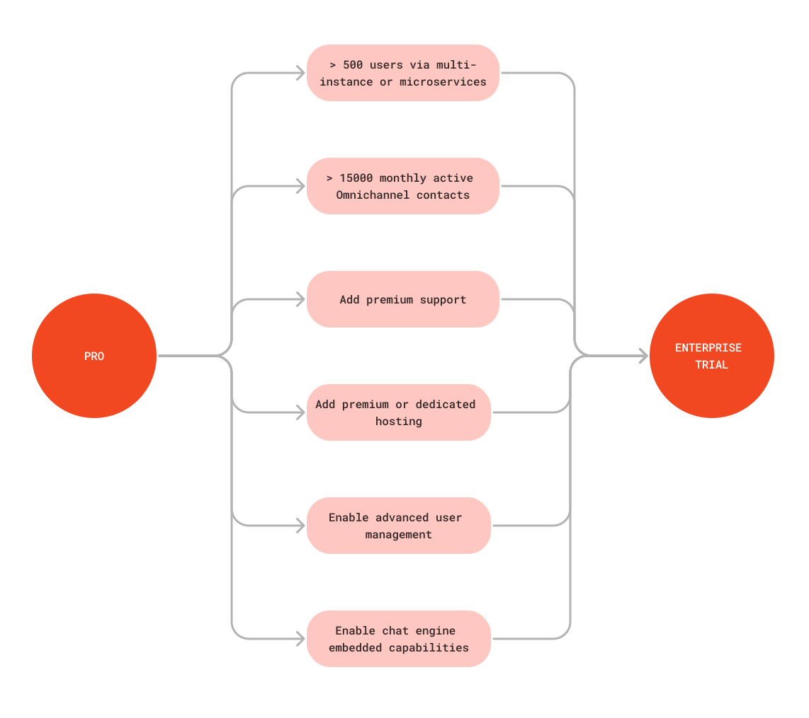

# Enterprise Trial

The Enterprise Plan is designed for large-scale organizations requiring a secure, customizable, and comprehensive communication platform. It provides scalable solutions, sophisticated compliance tools, and prioritized support to meet the intricate demands of major enterprises and sectors with strict regulatory standards. Emphasizing high performance, dependability, and advanced integration capabilities, this plan is an ideal selection for businesses looking for a premier collaboration platform.

If your workspace is on the Pro plan and exceeds some specific limits of the Pro plan, the 30-day Enterprise trial is activated. The following diagram shows the events that will trigger the Enterprise trial:

<figure><figcaption></figcaption></figure>

Rocket.Chat's Enterprise Plan trial allows potential users to experience the platform's advanced features before committing. By offering a comprehensive trial process, Rocket.Chat ensures that users can make an informed decision about upgrading to the Enterprise Plan.
