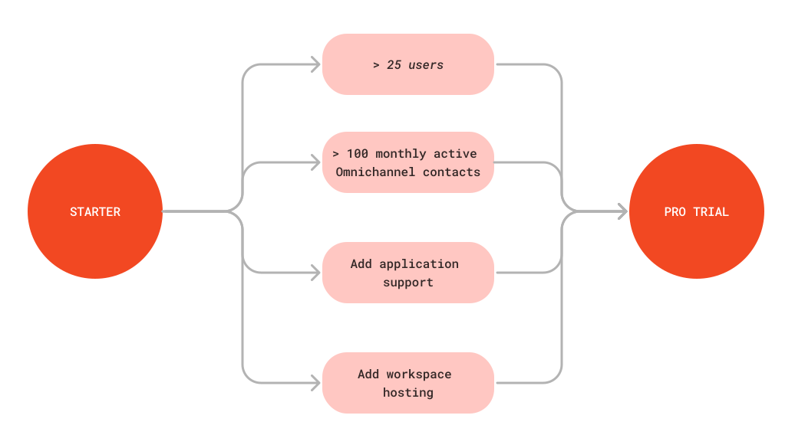

# Pro Trial

Available from Rocket.Chat version 6.5 or higher, the Pro Plan is ideal for organizations in growth mode needing enhanced features and support to broaden their communication capabilities. This plan presents a sturdy platform with expanded user capacity, increased monthly active contacts than the [Starter plan](../../readme/our-plans.md#starter-plan), and a suite of additional premium features. Perfectly suited for businesses on an upward trajectory, the Pro Plan strikes an ideal balance between advanced functionality and robust support, ensuring a smooth and effective collaboration experience.

If your workspace is on the Starter plan and exceeds some specific limits of the Starter plan, the 30-day Pro trial is activated. The following diagram shows the events that will trigger the Pro trial:

<figure><figcaption></figcaption></figure>

With this, Rocket.Chat allows potential users to test drive its Pro Plan through a detailed trial, providing a hands-on experience with its advanced capabilities. This enables users to thoroughly assess the platform's features, ensuring that they are well-equipped to decide on upgrading to the Pro Plan.
