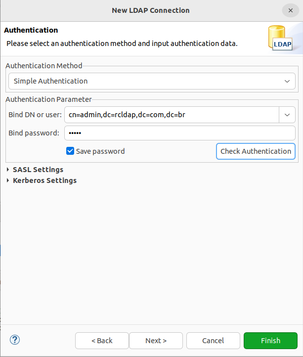
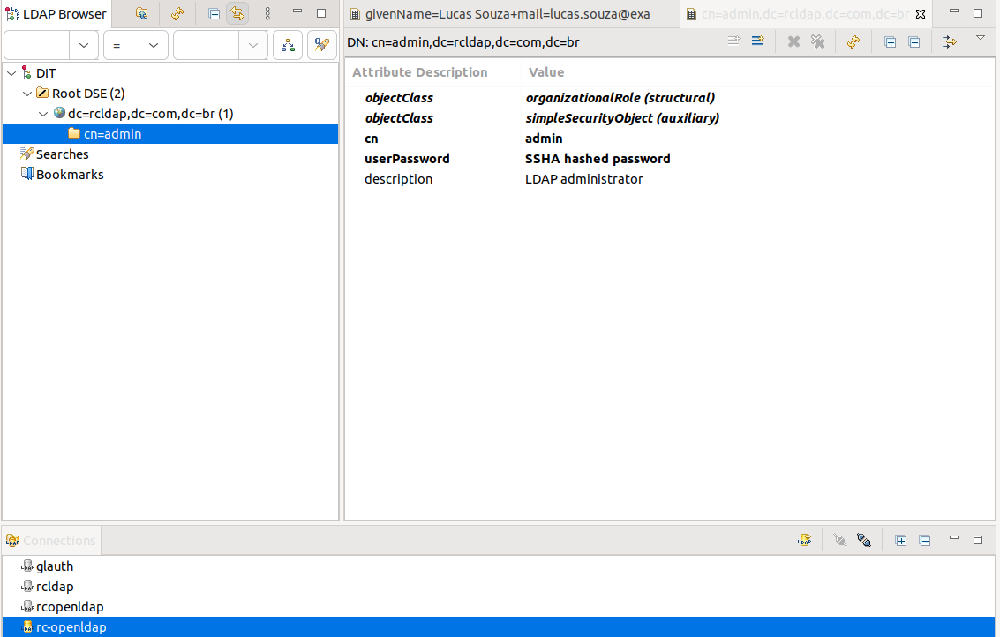
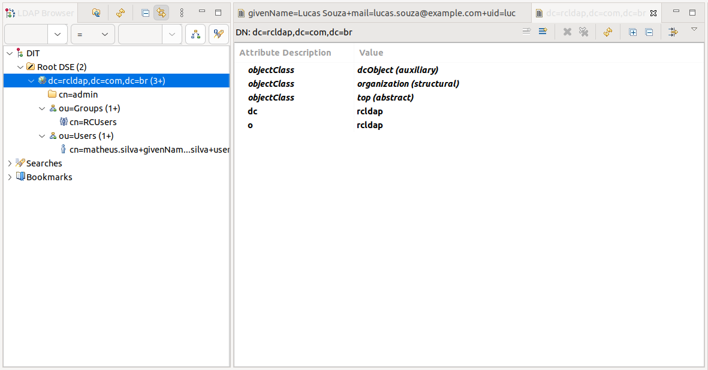
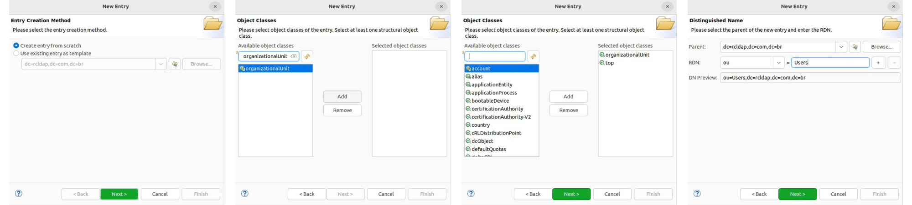
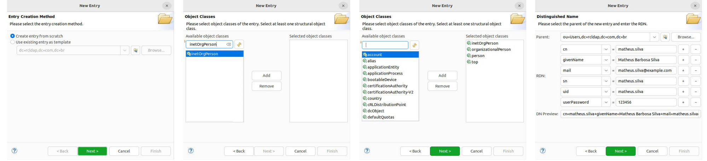
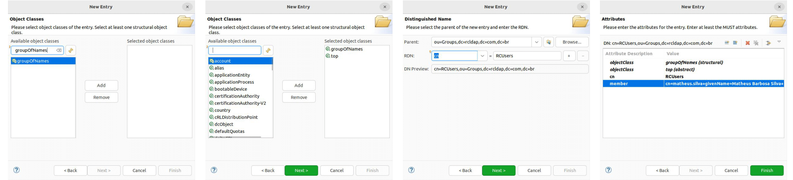

# LDAP Setup Example

After exploring the comprehensive LDAP settings in Rocket.Chat, it's beneficial to examine practical examples of these configurations. This requires an up-and-running LDAP server, which we'll guide you through how to set up (using [Osixia OpenLDAP](https://github.com/osixia/docker-openldap)) in order to build a clearer understanding of how Rocket.Chat's LDAP settings can be applied in real-world scenarios.

## Running an LDAP Server

Rocket.Chat allows workspace owners to connect to OpenLDAP or Active Directory LDAP servers to authenticate or retrieve information. In this first step, we'll guide you through how to set up an LDAP server using Docker and OpenLDAP, which is an open-source implementation of the LDAP protocol. For starters, navigate to your preferred directory and create a `docker-compose.yml` file with the following content:

```yaml
services:
  openldap:
    image: osixia/openldap:1.3.0
    container_name: rc-openldap
    environment:
      LDAP_LOG_LEVEL: "256"
      LDAP_ORGANISATION: "rcldap"
      LDAP_DOMAIN: "rcldap.com.br"
      LDAP_ADMIN_PASSWORD: "admin"
    volumes:
      - /var/lib/ldap
      - /etc/ldap/slapd.d
      - /container/service/slapd/assets/certs/
    ports:
      - "389:389"
      - "636:636"
```

Then, use `docker compose up` to start the container. This will locally deploy an **Osixia OpenLDAP** server running on port 389 (or 636 if the default one is unavailable).

Also, for the next steps, you'll need to download and install [Apache Directory Studio](https://directory.apache.org/studio/downloads.html) (ADS), but any LDAP data management tool (such as phpLDAPadmin) will do the job. After installing, open your LDAP management tool and create a new connection (in ADS, this can be achieved through the **Connections** section) using the following information:

* **Host name:** `localhost`
* **Port:** `389`
* **Authentication method:** `Simple authentication`
* **Admin user's Bind DN:** `cn=admin,dc=rcldap,dc=com,dc=br`
* **Bind password:** `admin`

Apache Directory Studio's authentication model should look as follows (click "Finish" to complete the connection's setup):



After successfully connecting to the LDAP server through ADS, an LDAP tree structure containing an admin and the standard domain (`dc=rcldap,dc=com,dc=br`) should be displayed:



ADS is now ready to populate the LDAP server with groups and users that can connect to Rocket.Chat.

## Add organizational units, users, and groups

For this example's use case, all users and organizational units will be added under the default domain already provided after setting up the LDAP server.


Refer to [Oracle LDAP Security Fundamentals Docs](https://docs.oracle.com/cd/E79533\_01/VSMGU/ldap001.htm) for details about Users, Groups, and Organizational Units in LDAP servers.


After setting up all organizational units, groups, and users as described in the next steps, your LDAP tree structure should look as follows:



### Organizational units

To add new organizational units within the default domain, right-click on its element (`dc=rcldap,dc=com,dc=br`) in the tree structure, then choose **New > New Entry** and follow the steps provided in the screenshot below.

Create two organizational units with the `organizationalUnit` object class: **Users** and **Groups**



### Users

For this example, users must be added under the **Users** organizational unit. Right-click on the `ou=Users` element in the tree structure, then choose **New > New Entry** and follow the steps provided below (use the `inetOrgPerson` object class).



### Groups

For this example, we'll only allow users who are members of a given LDAP group to log in to Rocket.Chat. To do that, add a new `RCUsers` group under the **Groups** organizational unit with a right-click on the `ou=Groups` element in the tree structure, then select **New > New Entry** and follow the steps provided in the screenshot below.

Use the `groupOfNames` object class and browse to the user you just created in order to assign it to a `member` property of the group in the last step.



More members can be added to the group later by adding new `member` attributes to the existing `RCUsers` group.

## **Connection**

Access **Workspace > Settings > LDAP > Connection**, enable LDAP and configure the settings as follows:

* **Server Type:** `Other`
* **Host:** `localhost`
* **Port:** `389`

Save the changes and press the **"Test Connection"** button on the upper-right side of the screen. An "LDAP Connection Succesful" toast message should be displayed.

## Authentication

Access **Workspace > Settings > LDAP > Connection > Authentication** and configure the settings as follows:

* **User DN:** `cn=admin,dc=rcldap,dc=com,dc=br`
* **Password:** `admin`

## Search Filter

Access **Workspace > Settings > LDAP > User Search > Search Filter** and configure the settings as follows:

* **Base DN:** `dc=rcldap,dc=com,dc=br`
* **Filter:** `(objectclass=inetOrgPerson)`
* **Scope:** `sub`
* **Search Field:** `uid`
* **Search Page Size:** `250`
* **Search Size Limit:** `1000`

After this step, you should be able to successfully search LDAP users in your workspace using the connection that has been set up. Try it with the "Test LDAP Search" button on the upper right side of the screen. Specify an LDAP user's `uid` field, and a successful toast message should be displayed.

## Group Filter

Configuring this section will restrict access to Rocket.Chat to members of the `RCUsers` group built in the previous steps. Access **Workspace > Settings > LDAP > User Search > Group Filter**, enable it (switch on "Enable LDAP User Group Filter") and configure the settings as follows:

* **Group ObjectClass:** `groupOfNames`;
* **Group ID Attribute:** `cn`;
* **Group Member Attribute:** `member`;
* **Group Member Format:** `#{userdn}`;
* **Group name:** `RCUsers`.

After this step, LDAP users should already be able to log in to Rocket.Chat using their `uid`/`mail` and password set in the LDAP server!


To sync new users that exist in your LDAP directory but not in Rocket.Chat, you must enable the **Background Sync Import New Users** option in **LDAP** > **Premium** > **Background Sync**. Click **Sync Now** and your new users are imported to your workspace.


## Log in with an email address

Rocket.Chat allows workspace owners to pick which LDAP fields will be used to identify users on authentication. By default, the `uid` field is set so that users can log in using username and password. However, this can be customized in **Workspace > Settings > LDAP > User Search > Search Filter > Search Field** to allow distinct login formats:

* Log in with either e-mail address or username: `uid,mail`;
* Log in with e-mail address: `mail`.

## LDAP SSL connection

When you enable LDAP, the login form will log in users via LDAP instead of the internal account system.

Here, we are using Stunnel to create a secure connection to the LDAP server. Create a new configuration file `/etc/stunnel/ldaps.conf` with the following content:

```
options = NO_SSLv2

[ldaps]
client = yes
accept = 389
connect = your_ldap_server.com:636
```

To enable Stunnel automatic startup, change the `ENABLED` variable in `/etc/default/stunnel4` to `1`:

```bash
# Change to one to enable stunnel automatic startup
ENABLED=1
```

Finally, on the Rocket.Chat server under `/admin/LDAP` set these values:

* LDAP host = `localhost`
* LDAP port = `389`

By tailoring these settings to your specific environment, you can ensure a secure, efficient, and user-friendly experience. As we conclude this section, remember that these examples serve as a guide, and it's crucial to adapt them to the unique requirements of your workspace.

This concludes the LDAP configuration section, which provides the various connection and user management settings in Rocket.Chat.
