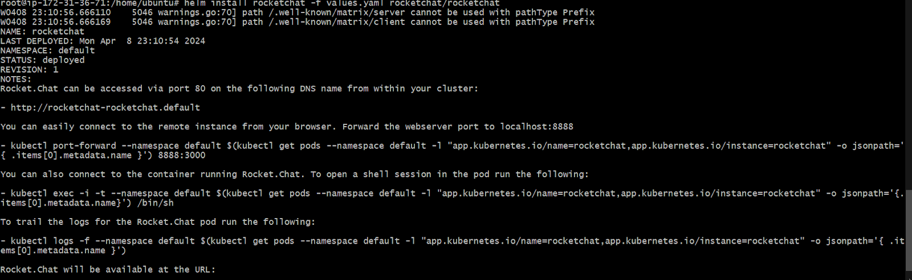
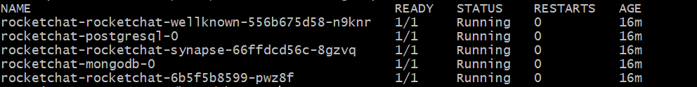
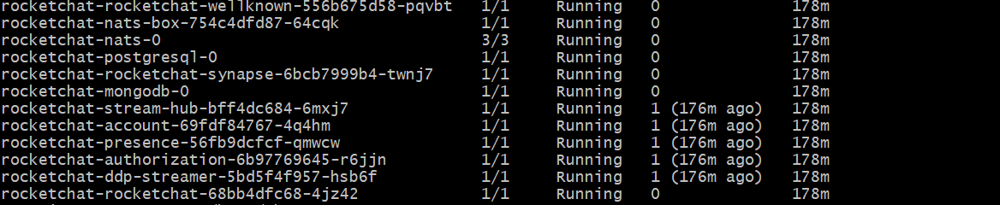

# Deploy a Federated Rocket.Chat Workspace

To configure a Matrix bridge that allows Rocket.Chat users to engage in federated rooms and communicate with federated users, a homeserver is required. [Homeservers](https://matrix.org/docs/matrix-concepts/elements-of-matrix/#homeserver) are key components that host user accounts and other data related to communication. It also facilitates communication between users on different servers by relaying messages through a network of matrix servers until they reach the destination. Rocket.Chat listens to events happening in the homeserver and sends events relayed to other networks. For further details, explore the [Rocket.Chat and Matrix architecture](https://github.com/RocketChat/federation-docs/blob/cdd9c3823e4f4329c87402640543226f8423fbd1/DESIGN.md).

This documentation details the deployment of a Federated Rocket.Chat workspace with Kubernetes using Helm.  You have the option to deploy it either as a monolithic setup or as microservices.


Before you proceed, kindly consult the official guide for[ deploying a basic Rocket.Chat workspace on Kubernetes using Helm](https://docs.google.com/document/d/1I6FmYzIiK959Nyq-PQLzbR9v8yKiuP9OryUZGOwhrNw/edit?usp=sharing) to gain a foundational understanding of the Kubernetes procedure.


## Prerequisites

* A Kubernetes cluster up and running
* Helm must be installed
* Your firewall rules must allow HTTPS traffic
* The following Kubernetes resources must be deployed on your server:
  * [Storage Class](https://kubernetes.io/docs/concepts/storage/storage-classes/)
  * [Ingress controller](https://kubernetes.io/docs/concepts/services-networking/ingress-controllers)&#x20;
  * Certificate controller&#x20;
  * ClusterIssuer
  * [Persistent Volume](https://kubernetes.io/docs/concepts/storage/persistent-volumes/)
  * [Persistent Volume Claim](https://kubernetes.io/docs/concepts/storage/volumes/#persistentvolumeclaim)
* You require two domains. For example,
  * _domain.xyz_ - The URL for your Rocket.Chat workspace
  * _synapse.domain.xyz_ - The URL for your Synapse server


Ensure that the domains are pointing to your server IP.


Once you've confirmed that all prerequisites are met, continue with the following steps to deploy a federated Rocket.Chat workspace using Kubernetes.

1. **Define the deployment configurations**

To deploy a federated Rocket.Chat workspace with the [official Rocket.Chat helm chart](https://github.com/RocketChat/helm-charts/tree/master/rocketchat), define the configuration options for your deployment in a _values.yaml_ file.

**For a monolithic deployment, create a **_**values.yaml**_** with the following contents:**

```yaml
image:
 pullPolicy: IfNotPresent
 repository: registry.rocket.chat/rocketchat/rocket.chat
 tag: <release> #Replace it with your target release


mongodb:
 enabled: true  #For test purposes, a single mongodb pod is deployed, consider an external MongoDB cluster for production environments
 auth:
   passwords:
     - rocketchat
   rootPassword: rocketchatroot


microservices:
 enabled: false  #This must be set to false
host: domain.xyz  #This is the domain for your Rocket.Chat server, Replace it with your own domain
ingress:
 enabled: true
 ingressClassName: nginx  # State the ingress controller that is installed in the K8s cluster
 annotations:
   cert-manager.io/cluster-issuer: production-cert-issuer # Replace with the name of your ClusterIssuer
 tls:
   - secretName: federation #This is the name of the secret - You can use a different name if needed
     hosts:
       - domain.xyz #This is the domain for your Rocket.Chat server, Replace it with your own domain 
       - synapse.domain.xyz #This is the domain for your Synapse server, Replace it with your own domain 

federation:
 enabled: true
 host: synapse.domain.xyz #This is the domain for your Synapse server, Replace it with your own domain 
 persistence:
   enabled: true
   existingClaim: synapse-helm #Replace with the name of your persistent volume claim

postgresql:
 enabled: true 
```

**For a microservices deployment, create a **_**values.yaml**_** with the following contents:**

```yaml
image:
 pullPolicy: IfNotPresent
 repository: registry.rocket.chat/rocketchat/rocket.chat
 tag: 6.6.6 #Replace it by your target release
 replicaCount: 1 #Number of replicas/pods for Rocket.Chat


mongodb:
 enabled: true  #For test purposes, a single mongodb pod is deployed, consider an external MongoDB cluster for production environments
 auth:
   passwords:
     - rocketchat
   rootPassword: rocketchatroot

microservices:
  enabled: true
  presence:
    replicas: 1
  ddpStreamer:
    replicas: 1
  account:
    replicas: 1
  authorization:
    replicas: 1
  streamHub:
    replicas: 1
  nats:
    replicas: 1

host: domain.xyz  This is the domain for your Rocket.Chat server, Replace it with your own domain 
ingress:
 enabled: true
 ingressClassName: nginx  #State the ingress controller that is installed in the K8s cluster 
 annotations:
   cert-manager.io/cluster-issuer: production-cert-issuer #Replace with the name of your ClusterIssuer
 tls:
   - secretName: federation #This is the name of the secret - You can use a different name if needed
     hosts:
       - domain.xyz #This is the domain for your Rocket.Chat server, Replace it with your own domain 
       - synapse.domain.xyz #This is the domain for your Synapse server, Replace it with your own domain 
federation:
 enabled: true
 host: synapse.domain.xyz #This is the domain for your Rocket.Chat server, Replace it with your own domain
 persistence:
   enabled: true
   existingClaim: synapse-helm #Replace with the name of your persistent volume claim

postgresql:
 enabled: true
```

* Replace the `<release`> with the [Rocket.Chat release](https://github.com/RocketChat/Rocket.Chat/releases) tag you want to deploy.
* Update _domain.xyz_ with your domain name
* Optionally, you can use a different `secretName` for `tls`.
* Ensure that the appropriate `ingressclassName`,  `existingClaim`, and cluster issuer are specified.
* You can also update the replicas for your microservices deployment.


Kindly refer to the [official documentation](https://docs.rocket.chat/deploy/deploy-rocket.chat/additional-deployment-methods/deploy-with-kubernetes#define-the-configurations-in-a-file) to learn more about the various configurations you can set for Helm in Rocket.Chat. To use microservices, visit our [Microservices documentation](https://docs.rocket.chat/deploy/deploy-rocket.chat/scaling-rocket.chat/microservices) for more details.


2. **Install Rocket.Chat & Synapse**

* Add the Rocket.Chat[ helm chart repository](https://github.com/RocketChat/helm-charts/tree/master/rocketchat) by running the following command:

```
helm repo add rocketchat https://rocketchat.github.io/helm-charts
```

If successful, it returns a response that "rocketchat" has been added to your repositories.

* Install Rocket.Chat with the following command:

```
helm install rocketchat -f values.yaml rocketchat/rocketchat
```

If your deployment is successful, you’ll get a response similar to the following:

<figure><figcaption></figcaption></figure>

* Verify that the corresponding certificates, secrets, and pods have been successfully created with the `kubectl get pods` command.

**For a monolithic deployment**, the response is similar to the image below, depending on your configurations:

<figure><figcaption></figcaption></figure>

**For a microservices deployment**, the response is similar to the image below, depending on your configurations:

<figure><figcaption></figcaption></figure>

You can now access your workspace via the URL where Rocket.Chat was deployed (your domain), and complete the [Setup Wizard](https://docs.rocket.chat/setup-and-configure/accessing-your-workspace/rocket.chat-setup-wizard).&#x20;

3. **Test the federation**

To test the federation, send a[ direct message](../../user-guides/rooms/direct-messages/) to any user on a matrix-compatible server. You can DM a user on another federated Rocket.Chat workspace or Element.

**To send a DM to a user on Element:**

* Create a user account on [Element](https://app.element.io/)
* Create a[ 1:1 Direct Message](https://docs.rocket.chat/use-rocket.chat/user-guides/rooms/direct-messages/create-a-new-direct-message) on your Rocket.Chat workspace. Add the [Element](https://app.element.io/) user as a member of the DM using this syntax: `@username:matrix.org`. Then, send a message.
* You receive an invite notification on Element that the user from your Rocket.Chat workspace wants to send a message. Accept the invite and continue the conversation.

**To send a DM to a user on another federated Rocket.Chat workspace:**

* Deploy another federated workspace with the steps highlighted above.
* Create a[ 1:1 Direct Message](https://docs.rocket.chat/use-rocket.chat/user-guides/rooms/direct-messages/create-a-new-direct-message) on your Rocket.Chat workspace. Add a user from the second federated workspace as a member of the DM using this syntax: `@username:server`.  For example, `@test_user:your_workspace_domain`.
* Then, send the message to the user.
* The user receives the message and you can continue exchanging conversations.


Kindly refer to [create-federated-rooms.md](../federation-user-guide/create-federated-rooms.md "mention") to learn more about sending messages to federated users.


Now that your federated workspace is ready, you can:

* Go to the[ Matrix User's Guide](https://docs.rocket.chat/use-rocket.chat/workspace-administration/settings/federation/matrix-bridge/matrix-users-guide) to learn how to invite external users on the Matrix protocol to your workspace, join channels on the Matrix network, etc.
* [Allow or block](https://docs.rocket.chat/use-rocket.chat/workspace-administration/settings/federation/matrix-bridge/matrix-admin-guide/matrix-homeserver-setup/matrix-allow-block-list) specific IP addresses to communicate with your workspace.\
