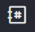
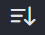

# Main Menu

The icons in your main menu are designed to enhance your navigation experience within the workspace.

### User Panel

The [user-panel](user-panel/ "mention") provides access to your profile management options and allows you to log out of the workspace.

### Home

Click the **Home icon** to navigate to the home screen of your workspace. The home screen welcomes a user to the Rocket.Chat workspace. It is the first screen that is displayed after a user logs in successfully. It prompts you to start using your workspace and also provides links to some key features of Rocket.Chat.

### Search

The **Search icon** allows you to quickly search for a user or [room](rooms/) within the workspace. To perform a search, simply click on the search icon, and a search bar will appear. Type your query, and the related results are displayed in real-time.

### Directory

The **Directory icon** offers a convenient way to access the workspace's directory and search for [channels](rooms/channels/), [users](../workspace-administration/users/), and [teams](rooms/teams/) within the workspace.

### Display

The **Display icon** controls the display settings of your workspace sidebar, allowing you to customize how chats are presented. Click on the display icon to access display settings. You can customize how conversations are displayed, sorted, and grouped in your workspace.

### Create New

Click the **Create New icon** to create a new [room ](rooms/)in your workspace.&#x20;

### Administration

Click the **kebab icon** to access the administration panel. The options displayed for a user vary depending on the permission assigned to them. The **Administration** tab is available for workspace administrators to manage workspace and [omnichannel](../omnichannel/) settings. The **Apps** tab provides the option to manage [apps](../../extend-rocket.chat-capabilities/rocket.chat-marketplace/) in your workspace. The **Audit** tab is available for auditors in the workspace to[ audit messages](../communication-management-hub/message-auditor/) and review the [audit log history](../communication-management-hub/message-auditor/audit-logs.md).&#x20;
