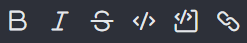
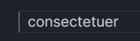
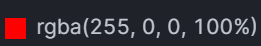
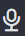
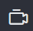

# Messages

In Rocket.Chat, conversations take place in [rooms](../rooms/).  To send a message, go to a room and type in the message box. Then, press **enter** or click the **send** button. \
While typing in the message box, press **Shift + Enter** to enter a new line.  You can also move the cursor using the arrow keys.&#x20;


Before you proceed, kindly ensure the [message.md](../../workspace-administration/settings/message.md "mention") settings for your workspace are configured to enable your prefered features.


Utilize the icons in the message box to upload files, format your message, record an audio/video message, and do much more while typing a message.

**Format Messages**

Improve your messages by making them clear and neat with various formatting options. You can format your messages using the formatting icons in the message box or markdown.

Highlight a message and click on any of the following formatting icons such as bold, italics, strikethrough, inline code block, multiline code block, and links.

<figure><figcaption><p>Formatting Icons</p></figcaption></figure>

Optionally you can use markdown to format your messages. Here is a list of the supported markdown formats you can use in your workspace:

<table><thead><tr><th>Markdown</th><th width="233">Example Input</th><th>Example Ouput</th></tr></thead><tbody><tr><td>Bold</td><td>*Hello Team*</td><td><strong>Hello Team</strong></td></tr><tr><td>Italics </td><td> _Hiya_</td><td><em>Hiya</em></td></tr><tr><td>Blockquoutes</td><td>>consectetuer</td><td></td></tr><tr><td>Color</td><td>color:#F00</td><td></td></tr><tr><td>Emoticon</td><td>:) :(</td><td></td></tr><tr><td>Escape </td><td>\*test\*</td><td>*test*</td></tr><tr><td>Headings</td><td># Heading1</td><td><h2>Heading</h2></td></tr><tr><td>Image</td><td><br></td><td></td></tr><tr><td>Links</td><td>&#x3C;https://rocket.chat|link><br>[secondlink](https://rocket.chat)</td><td><p><a href="https://rocket.chat/">link</a></p><p><a href="https://rocket.chat/">secondlink</a></p></td></tr><tr><td>Ordered list</td><td><ol><li>First item</li><li>Second item</li></ol></td><td><ol><li>First item</li><li>Second item</li></ol></td></tr><tr><td>Unordered list</td><td>- First item<br>- Second Item</td><td><ul><li> First item</li><li> Second Item</li></ul></td></tr><tr><td>Tasks list</td><td>- [ ] Get press release<br>- [x] Checked item<br></td><td><ul class="contains-task-list"><li><input type="checkbox">Get press release</li><li><input type="checkbox" checked>Checked item</li></ul></td></tr><tr><td>Phone</td><td><p>[here](+(075)-63546725)<br> +(075)-63546725 </p><p>+07563546725</p></td><td><a href="tel:07563546725">here</a><br><a href="tel:07563546725">+(075)-63546725</a><br><a href="tel:07563546725">+07563546725</a></td></tr><tr><td>Strikethrough</td><td>~Lorem ipsum dolor~</td><td><del>Lorem ipsum dolor</del></td></tr><tr><td>Inline codeblock</td><td>`welcome`     </td><td><code>welcome</code></td></tr><tr><td>Multiline codeblock</td><td>```<br>npm install<br>``` </td><td><pre><code>npm install
</code></pre></td></tr></tbody></table>

**Upload Files**

To upload files in a room,

* Click the **upload file icon** in the message box and choose the files,  or drag and drop the files into the message box. You can also paste an image from your clipboard in the message box.
* Add a file name and description, and click **Send**.


It's important to note that the workspace administrator can [restrict the upload of certain file types](../../workspace-administration/settings/file-upload/#general-settings).


To forward files from a room,&#x20;

* Hover over the file message and click the **forward message icon**.
* Select the user or room to forward the message and click **Forward**.

To search for files in a room,

* Click the **kebab menu icon** on the room header and select **Files**.
* Choose the file type you want to search for, then proceed with your search.


To upload files from Google Drive, see the [google-drive](../../../extend-rocket.chat-capabilities/rocket.chat-marketplace/rocket.chat-public-apps-guides/google-drive/ "mention") app guide.


**Record audio and video message**

To improve communication with team members, you can send audio and video messages within a room. Other users in the room can listen to and respond to your message.

To start recording an audio message,&#x20;

* Go to a room and click the  **audio message icon** in the message box.
* Click the   **check icon** to finish the recording. Click the  **cancel icon** if you want to discard the recording.
* Add a file name and description, then click **Send**.

To start recording a video message,

* Click the  **video message icon** in the message box. A video preview window is displayed.
* Click the  **record** button to start recording.
* Click the  **record** button again to finish the recording and hit **Send.** Click the **cancel** button if you want to discard the recording.
* Add a file name and description, then click **Send**.


Remember to grant Rocket.Chat permission to access your microphone and webcam when prompted.


**Location**

To share your location in a room,

* Click the  **plus icon** in the message box.&#x20;
* Select **Share > Location.** A Google Maps preview of your location is displayed.
* Click **Share** to send your location, or **Cancel** to discard it.

**Emoji**

To insert an emoji,&#x20;

* Click the emoji icon in the message box.&#x20;
* Browse emojis using the icon categories or the search box.&#x20;
* Select the emojis you want to use inside your message.&#x20;
* Hit **enter** or click **send**.

Alternatively, you can also insert emojis by inputting an [emoji code](https://www.webfx.com/tools/emoji-cheat-sheet/). For example, typing :) will automatically convert into a smiley face emoji.

To disable emojis in your workspace, kindly refer to [#messages](../user-panel/account.md#messages "mention"). When graphical emojis are disabled, emoji keywords and shortcuts display as regular text.

**Typing indicator**

When a user types in a channel, a typing indicator appears for others below the message box. For instance, "**User-5 is typing**."

**Mention users**

To mention your team member in a channel, type `@` followed by their username (e.g., `@username`). The mentioned user will be notified through a red badge or email/mobile notification if offline. For important announcements, use `@all` sparingly to notify everyone in the channel.

#### View PDF files

You can view PDF attachments within the app from the release version 6.6.0 and the desktop app version [3.9.13](https://github.com/RocketChat/Rocket.Chat.Electron/releases/tag/3.9.13).&#x20;

* The PDF Viewer is only supported for the desktop app.
* In the **File Upload** settings, the file **Storage Type** must be **Amazon S3** or **Google Cloud Storage**. See [File Upload](https://docs.rocket.chat/use-rocket.chat/workspace-administration/settings/file-upload).

To access the **PDF Viewer**, send a PDF file attachment to any channel. Select the PDF and the **PDF Viewer** screen displays the file contents within the app.
