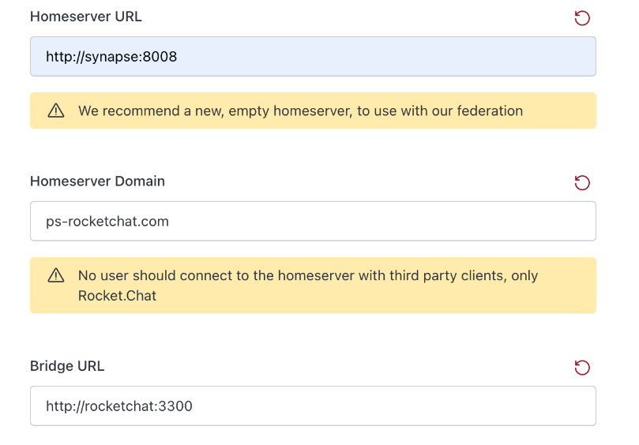
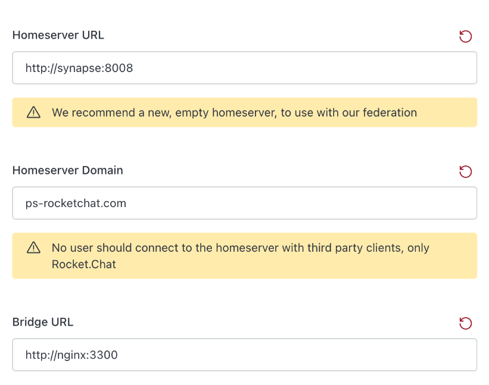
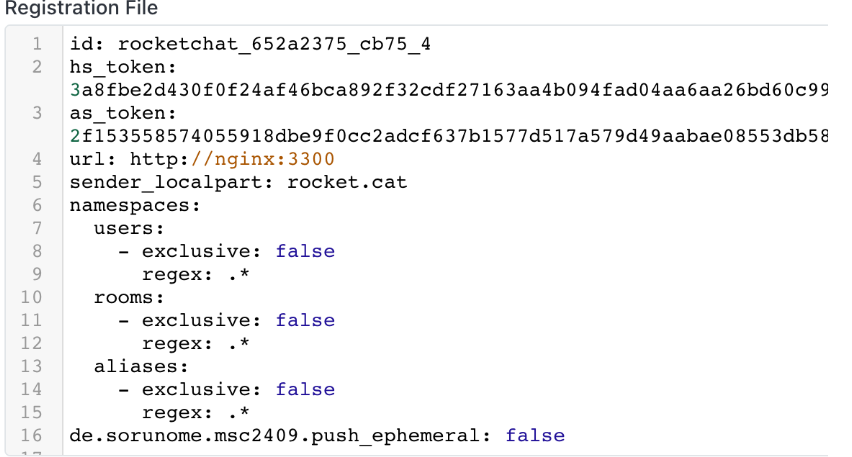

# Matrix Homeserver Setup

Homeservers are key components that hosts user accounts and other data related to communication. It also facilitates communication between users on different servers by relaying messages through a network of matrix servers until it reaches the destination. Rocket.Chat listens to events happening in the homeserver and sends events relayed to other networks.

You can set up your federated Rocket.Chat workspace using any of the following methods:

* [**Automated Installation**](./#automated-installation): Install Synapse and Rocket.Chat using a simple setup script.
* [**Manual Installation**](./#standalone-manual-installation): Manually install and configure your Homeserver with Rocket.Chat.


We recommend using[ automatic installation](./#automated-installation) since this comes with some pre-configurations.


## System Requirements

* 8GB of RAM
* 2CPU
* 20GB of Storage
* Ubuntu 20.04


You are required to have a domain available to host your matrix homeserver.


## Important warning about the installation

You must be aware of this vital setting before proceeding with the installation.

* Enabling ephemeral events like _user typing indicator_ can affect the performance of your Matrix Homeserver and Rocket.Chat server for federated communication.\
  This can be enabled by adding the following property in your Application Service configuration file:

```yaml
de.sorunome.msc2409.push_ephemeral: true
```

* Add and enable the following properties to make public rooms visible and searchable on other Matrix networks.

```yaml
allow_public_rooms_without_auth: true
allow_public_rooms_over_federation: true
```

* Following the automated installation enables everything by default and can be disabled by editing the generated configuration at `data/matrix/synapse`.

## Automated Installation

The automated install offers a simple option to install a matrix homeserver pre-configured with Rocket.Chat.

**Prerequisites**

You are required to have the following on your system before installing.

* [Docker](https://www.docker.com/) and [Docker compose](https://docs.docker.com/compose/) (> 2.3.3)


If you don't have them installed, you can conveniently set them up using Docker's official helper script:

```bash
curl -L https://get.docker.com | sh
```

* To run Docker commands without using sudo, add the current user to the Docker group and then reboot using the following commands:

```bash
sudo usermod -aG docker $USER
sudo reboot
```


* A domain pointing to your server's IP.

### Installation Steps

* Open your terminal in any directory of your choice.
* Download and execute the [script](https://go.rocket.chat/i/federation-setup) by running the following command. This creates a `docker-compose` and a `.env` file that can be edited as needed

```bash
bash <(curl -L -s https://go.rocket.chat/i/federation-setup)
```

* Follow the instructions provided by the script to configure the workspace:
  * **Server's hostname**: Add your domain name.
  * Create `A` domain records pointing to your server's IP address as requested.
    * `synapse.<your-domain>`
    * `element.<your-domain>`
    * `traefik.<your-domain>`
  * Enter your email address. This is used to issue an SSL certificate for your domain.

<details>

<summary>Update your Rocket.Chat version</summary>


If you want to install a specific version Rocket.Chat, navigate to the  `.env` file, and modify the `RELEASE`  variable to point to the [docker image tag](https://hub.docker.com/r/rocketchat/rocket.chat/tags/) of that version.

```
RELEASE=<desired version>
```

</details>

* Start the container by running the following command:

```bash
docker compose up -d
```


Installing with the Automated setup automatically sets the values at **Administration** > **Workspace** > **Settings** > **Federation** > **Matrix Bridge.**



Rocket.Chat Matrix setup CLI is coming soon!


**Testing the Setup**

To test and ensure your Matrix setup is successful,

* Download and execute the test script in the same directory where the setup was initiated.

```bash
bash <(curl -L -s https://go.rocket.chat/i/federation-test)
```

* You get a notice about the setup status.

## Standalone Manual installation

**Prerequisites**

* [Docker](https://www.docker.com/)


If you don't have it  installed, you can conveniently set it  up using Docker's official helper script:

<pre class="language-bash"><code class="lang-bash"><strong>curl -L https://get.docker.com | sh
</strong></code></pre>

* To run Docker commands without using sudo, add the current user to the Docker group and then reboot using the following commands:

```bash
sudo usermod -aG docker $USER
sudo reboot
```


* Your domain records and SSL certificates. For example, if your domain is _`ps-rocketchat.com,`_ you can create subdomains under it like _`matrix2.ps-rocketchat.com`_.&#x20;


Name the subdomains based on your preference.


* All the generated DNS records pointed to your server's IP address (the same IP address).

### Installation Steps

To set up a Matrix Homeserver with Synapse manually,


Replace _`ps-rocketchat.com`_ and _`matrix2.ps-rocketchat.com`_ with your domain and subdomain respectively while following this guide.


* Set up the docker network with this command:

```
docker network create rocketchat
```

* To set up a [Synapse](https://matrix.org/docs/projects/server/synapse) server, run this command to set up the Synapse environment:

```
docker run --rm -e SYNAPSE_SERVER_NAME=ps-rocketchat.com -e SYNAPSE_REPORT_STATS=yes -v $PWD/data:/data matrixdotorg/synapse generate
```

The `homeserver.yaml` configuration file is stored in the "_data_" directory of your current working directory. To start the Synapse Docker, use this command:

```
docker run --name synapse --network rocketchat -v $PWD/data:/data:rw -d matrixdotorg/synapse
```

* Next, set up MongoDB with this command:


```
docker run --network rocketchat -d     --name "mongodb"     -e ALLOW_EMPTY_PASSWORD=yes -e MONGODB_REPLICA_SET_MODE=primary     -e MONGODB_REPLICA_SET_NAME=rs0 -e MONGODB_PORT_NUMBER=27017     -e MONGODB_INITIAL_PRIMARY_HOST="mongodb" -e MONGODB_INITIAL_PRIMARY_PORT_NUMBER=27017     -e MONGODB_ADVERTISED_HOSTNAME="mongodb" bitnami/mongodb:5.0
```


* To start Rocket.Chat , execute this command:

```
docker run --network rocketchat -d 	--name "rocketchat" 	-e ROOT_URL=https://ps-rocketchat.com -e PORT=3000 	-e MONGO_URL=mongodb://mongodb:27017/rocketchat?replicaSet=rs0 -e MONGO_OPLOG_URL=mongodb://mongodb:27017/local?replicaSet=rs0 	registry.rocket.chat/rocketchat/rocket.chat
```

**Set up Reverse Proxy**

Before accessing your Rocket.Chat workspace,  set up the reverse proxy following the next steps:

* Obtain SSL certificates for your domain records, if you don't have any. You can use [Lets Encrypt](https://letsencrypt.org/).
* Create an `nginx.conf` file containing forwarding rules for each domain. Create the  file in the same folder where you intend to start your docker instance and paste the following contents:

```
worker_processes 1;
events { worker_connections 1024; }
http {
    server {
	listen 443 ssl;
	server_name ps-rocketchat.com;
	ssl_certificate /cert/certificate.crt;
                  ssl_certificate_key /cert/private.key;
	add_header X-Frame-Options DENY;
	add_header X-Content-Type-Options nosniff;
	add_header X-XSS-Protection "1; mode=block";
        location /.well-known/matrix/server {
            default_type application/json;
            add_header Access-Control-Allow-Origin *;
	    return 200 '{"m.server": "matrix2.ps-rocketchat.com:443"}';
	}
        location /.well-known/matrix/client {
            default_type application/json;
            add_header Access-Control-Allow-Origin *;
            return 200 '{"m.homeserver": {"base_url": "https://matrix2.ps-rocketchat.com"}}';
        }
        location / {
            proxy_set_header Host $host;
            proxy_set_header X-Forwarded-For $remote_addr;
            proxy_set_header X-Forwarded-Proto $scheme;
            proxy_pass http://rocketchat:3000;
        }
   }
   server {
    listen 80;
    server_name ps-rocketchat.com;
    return 302 https://$server_name$request_uri;
   }
    
   server {
    listen 443 ssl;
    server_name matrix2.ps-rocketchat.com;
    ssl_certificate /cert/certificate.crt;
    ssl_certificate_key /cert/private.key;
	add_header X-Frame-Options DENY;
	add_header X-Content-Type-Options nosniff;
	add_header X-XSS-Protection "1; mode=block";
    location / {
        proxy_set_header X-Forwarded-For $remote_addr;
        proxy_set_header X-Forwarded-Proto $scheme;
        proxy_pass http://synapse:8008;
    }
  }
}

```

* Start the reverse proxy mapping the `nginx.conf` and the certificate and private key for SSL by running  this command:


Ensure to specify the paths to certificates if you are using relative paths. In this example, the reference location for certificates is the home folder.

Additionally, it's recommended to use the complete directory path for your nginx file, _for example — `/home/ubuntu/test/nginx.conf:/etc/nginx/nginx.conf:ro`_


```
docker run --name nginx --network rocketchat -p 443:443 -p 80:80 -v ./nginx.conf:/etc/nginx/nginx.conf:ro -v ./cert2/fullchain.pem:/cert/certificate.crt:ro -v ./cert2/privkey.pem:/cert/private.key:ro -d nginx
```

* Visit your domain URL in a web browser  to access your Rocket.Chat workspace. Complete the [#setup-wizard](../../../../../../../setup-and-configure/accessing-your-workspace/rocket.chat-setup-wizard.md#setup-wizard "mention") and your workspace will be set up and ready to use.

**Configure Rocket.Chat Matrix Bridge**


Before you proceed, subscribe to any of our [premium plans ](../../../../../../../readme/our-plans.md)or [apply trial ](../../../../../../../setup-and-configure/trials/)on your workspace to unlock all the available federation features.


See [matrixbridge-configuration.md](../matrixbridge-configuration.md "mention") to learn more about the configurations and their definitions.

Now that your workspace is set up, navigate to **Administration** > **Workspace** > **Settings** > **Federation > Matrix Bridge** and follow these steps:

* **Enable** Matrix Bridge.
* Update the following fields with these values:
  * **Homeserver URL**: http://synapse:8008
  * **Homeserver Domain**: \<your domain>
  * **Bridge URL**: http://rocketchat:3300


Be cautious not to include "https://" before your homeserver domain.


<figure><figcaption></figcaption></figure>

* Save your changes and copy the contents of your registration file.                                                     &#x20;

<figure><figcaption><p>App Service Registration File content</p></figcaption></figure>

* [Configure ](https://matrix-org.github.io/synapse/latest/application\_services.html)the support for [Application Service](https://matrix.org/docs/guides/application-services) on the matrix home server by creating a `registration.yaml` file in the _**data**_ directory that was created for synapse earlier and paste the contents of the registration file.&#x20;


Creating and modifying files in the _**data**_ directory may require administrative(sudo) rights.


* Add the following content at the end of the `homeserver.yaml` file in that same _**data**_ directory and save: &#x20;

```
app_service_config_files:
  - /data/registration.yaml
```

* Now restart the rocketchat and synapse containers with these commands:

```
docker restart synapse
docker restart rocketchat
```


Now, you can proceed to [test your workspace setup](./#testing-the-setup).



To run multiple Rocket.Chat instances, see [#clustered-manual-installation](./#clustered-manual-installation "mention").


## Testing your setup

For testing the Matrix setup, you can use the  [Matrix Federation Tester](https://federationtester.matrix.org/) if your certificates are from a “standard” CA recognized by Linux distros, etc.

For more real-time testing, visit [Element](https://app.element.io/) and complete these steps:

* Create a user using matrix.org as a homeserver (assuming the default whitelisted matrix.org is still set on your matrix homeserver)
* [Start a direct message](../../../../../../user-guides/rooms/direct-messages/) from your Rocket.Chat workspace with the user you just created using their matrixId _(@username:matrix.org)._
* Check [Element](https://app.element.io/) to confirm that you received the DM from your Rocket.Chat user. You can choose to respond to the message from [Element](https://app.element.io/) and confirm that you can receive the response in your Rocket.Chat workspace.&#x20;


Now that your federated is successful on your workspace, see the [matrix-users-guide](../../matrix-users-guide/ "mention") to learn more about how to use federation. &#x20;


### Use your own federation-tester

You can decide to use your own federation tester if you're in an air-gapped environment or if you use non-standard certificates.

* Download the [GitHub project](https://github.com/matrix-org/matrix-federation-tester) locally and run the test yourself from (supposing you have the CA in your keychain) using these commands:

```
git clone https://github.com/matrix-org/matrix-federation-tester.git
cd matrix-federation-tester 
go build
BIND_ADDRESS=:8080 ./matrix-federation-tester
```

* Now, execute this command:

```
curl 'http://localhost:8080/api/report?server_name=ps-rocketchat.com'
```

## Clustered Manual Installation

To distribute the work on Rocket.Chat, you run two identical Rocket.Chat applications ( _can be named `rocketchat1` and `rocketchat2`_) that both connect to the same MongoDB. To make this setup accessible externally, you use an NGINX load balancer. This load balancer acts as a single entry point, and internally it distributes the workload between the two Rocket.Chat instances.&#x20;


Before you proceed, ensure you have completed the [#standalone-manual-installation](./#standalone-manual-installation "mention").


* Start the second Rocket.Chat with this command:&#x20;

```
docker run --network rocketchat -d 	--name "rocketchat2" 	-e ROOT_URL=https://ps-rocketchat.com -e PORT=3000 	-e MONGO_URL=mongodb://mongodb:27017/rocketchat?replicaSet=rs0 -e MONGO_OPLOG_URL=mongodb://mongodb:27017/local?replicaSet=rs0 	registry.rocket.chat/rocketchat/rocket.chat
```

* Update the `nginx.conf` file with these contents

```
worker_processes 1;

events { worker_connections 1024; }

http {

    upstream web-rocketchat {
        ip_hash;
        server rocketchat:3000;
        server rocketchat2:3000;
    }

    upstream matrix-rocketchat {
        server rocketchat:3300;
        server rocketchat2:3300;
    }

    server {
       listen 3300;

       server_name nginx;

       location / {
            proxy_set_header Host $host;
            proxy_set_header X-Forwarded-For $remote_addr;
            proxy_set_header X-Forwarded-Proto $scheme;
            proxy_pass http://matrix-rocketchat;
        }
    }
    
    server {docker
    	listen 443 ssl;

    	server_name ps-rocketchat.com;

    	ssl_certificate /cert/certificate.crt;
        ssl_certificate_key /cert/private.key;

    	add_header X-Frame-Options DENY;
    	add_header X-Content-Type-Options nosniff;
    	add_header X-XSS-Protection "1; mode=block";

        location /.well-known/matrix/server {
            default_type application/json;
            add_header Access-Control-Allow-Origin *;
	       return 200 '{"m.server": "matrix2.ps-rocketchat.com:443"}';
	   }

        location /.well-known/matrix/client {
            default_type application/json;
            add_header Access-Control-Allow-Origin *;
            return 200 '{"m.homeserver": {"base_url": "https://matrix2.ps-rocketchat.com"}}';
        }

        location / {
            proxy_set_header Host $host;
            proxy_set_header X-Forwarded-For $remote_addr;
            proxy_set_header X-Forwarded-Proto $scheme;
            proxy_pass http://web-rocketchat;
        }
   }

   server {
    listen 80;

    server_name ps-rocketchat.com;

    return 302 https://$server_name$request_uri;
   }
    
   server {
    listen 443 ssl;
    server_name matrix2.ps-rocketchat.com;
    ssl_certificate /cert/certificate.crt;
    ssl_certificate_key /cert/private.key;

	add_header X-Frame-Options DENY;
	add_header X-Content-Type-Options nosniff;
	add_header X-XSS-Protection "1; mode=block";

    location / {
        proxy_set_header X-Forwarded-For $remote_addr;
        proxy_set_header X-Forwarded-Proto $scheme;
        proxy_pass http://synapse:8008;
    }
  }

}
```

* Restart nginx with this command:

```
docker restart nginx
```

* Navigate to **Administration** > **Workspace** > **Settings** > **Federation > Matrix Bridge** and update these configurations:
  * **Homeserver URL**: [http://synapse:8008](http://synapse:8008)
  * **Homeserver Domain**: \<your domain>
  * **Bridge URL**: [http://nginx:3300](http://rocketchat:3300)

<figure><figcaption><p>Matrix Bridge configurations</p></figcaption></figure>

* Save your changes and copy the contents of your registration file.

<figure><figcaption><p>Registration File</p></figcaption></figure>

* Paste the contents in the  `data/registration.yaml` file .
* Now restart the rocketchat and synapse containers with these commands:

```
docker restart synapse
docker restart rocketchat
docker restart rocketchat2           
```

* Now you can proceed to [test your workspace](./#testing-your-setup) again.

## Reset your environment and Restart your setup&#x20;

Execute the following commands to clean up your files, reset your environment, and restart your setup:

```
docker stop rocketchat
docker stop synapse
docker stop mongodb
docker remove rocketchat
docker remove synapse
docker remove mongodb
sudo rm -fr data
```


If you had a [cluster set](./#clustered-manual-installation),  you also need to stop/remove the rocketchat2 docker instance.



See [federation-faqs.md](../../../../../../../resources/frequently-asked-questions/federation-faqs.md "mention") for more troubleshooting tips.

