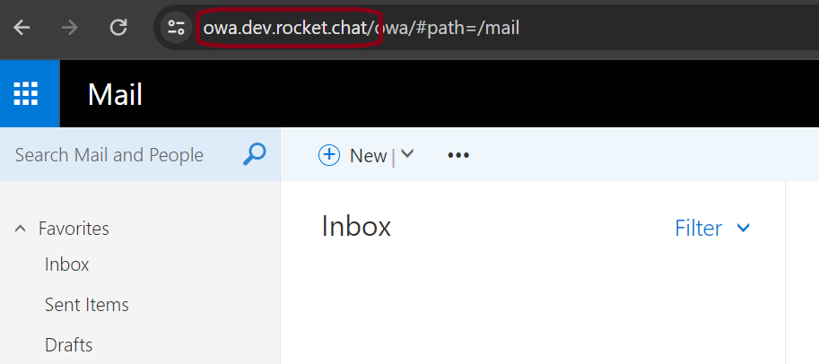
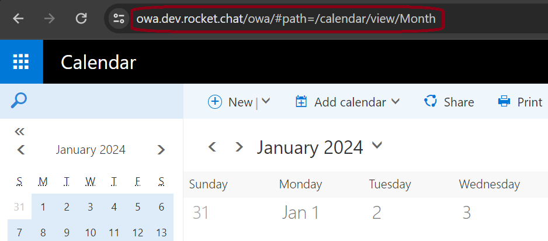

# Outlook Calendar

<figure><figcaption></figcaption></figure>

The **Outlook Calendar** integration allows users to sync their daily calendar events from Outlook to their Rocket.Chat workspace. It also provides quick action buttons to interact with the events, for example — joining a meeting.


* This integration only works with **Exchange Servers** and does not support Office 365.
* The Outlook Integration is only supported on the Rocket.Chat desktop application.


## Administrator settings

For users to access the Outlook calendar settings, the workspace administrator must follow these steps:

1. Go to **Administration** > **Workspace** > **Permissions**. Select the **Settings** tab.
2. Search for Outlook.
3. Enable the settings for the roles that you want, for example, the `user` role.

The following screenshot shows the **Settings** tab on the **Permissions** page:

<figure><figcaption></figcaption></figure>

Now end users with the role `user` can access and configure the Outlook calendar settings as described in the following sections.

## Configure Outlook calendar

To access the **Outlook calendar** on your workspace,

1. Navigate to **Administration > Workspace > Settings > Outlook Calendar**.
2. Select **Enable** to enable the integration.
3. Enter the following information:
   1.  **Exchange URL:** The exchange server URL you need to access the server. For example, `https://owa.xyz.rocket.cat/`. You can find this value from your browser:\

       <figure><figcaption></figcaption></figure>
   2.  **Outlook URL:** The Outlook application URL in the exchange server is used to redirect the user to the correct application. For example, `https://owa.xyz.rocket.cat/owa/#path=/calendar/view/Month`. You can find this value from your browser by going to the Outlook **Calendar** page:\

       <figure><figcaption></figcaption></figure>
   3. **Meeting url Regular Expression:** The expression used to detect meeting URLs in event descriptions. The first matching group with a valid URL will be used. HTML-encoded URLs will be decoded automatically.\
      \
      For example, the meeting URL is\
      `https://go.rocket.chat/conference?host=app.video.valtori.fi&path=conference%2Ftest_room%3FcallUrl%3Dhttps%253A%252F%252Fmeet.video.valtori.fi%252Fwebapp%252Fm%252Ftest_room%26callProvider%3DPexip`\
      \
      By default, the regular expression is `(?:[?&]callUrl=([^&<]+))|(?:(?:%3F)|(?:%26))callUrl(?:%3D)((?:(?:^&<))+[^&<]?)`\
      This will match everything that comes after `callURL=` and return the specific URL for the meeting.\

4. Click **Save changes**.
5. To access the Outlook calendar in a room, click the kebab menu at the room header. Select **Outlook calendar.** A sidebar is displayed.
   1. From the Outlook sidebar, click **Login**.
   2. Fill in your Outlook login details in the new window and sign in. Check the **Remember my credentials** option so that you can synchronize multiple times in the future without entering your credentials again.
   3. Now, all your events for the current date are fetched and synced to your workspace. Click an event to see more details about it. If the event has a conference call, click the **Join** button beside it to join the call.

## Calendar settings

Click **Calendar Settings** to perform the following actions:

1. **Event Notifications**: You can enable or disable event notifications based on your preferences.
2. **Outlook Authentication**: You can remove your credentials from your workspace by clicking **Disable**.

## Refresh Outlook sync

To refresh the sync, click the **Sync** button at the bottom of the sidebar.
